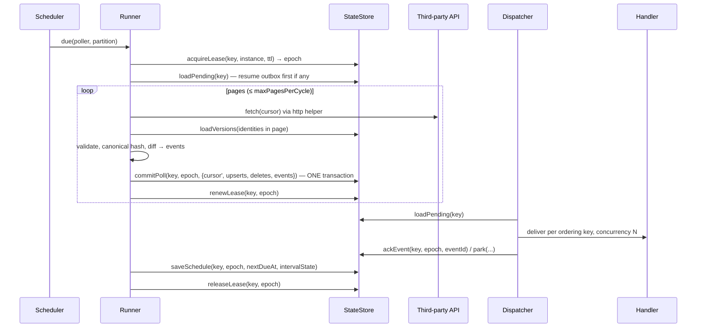
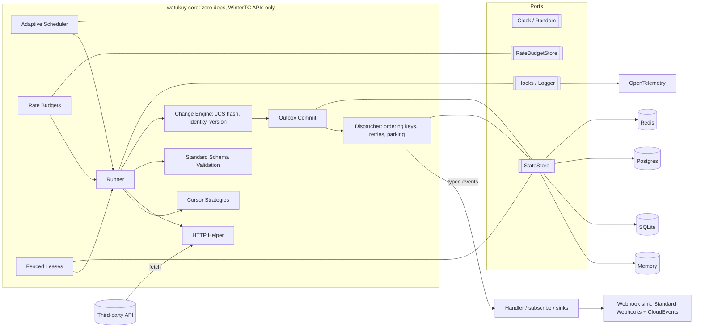

# watukuy — Launch Plan (v0.2)

> Quechua: **watukuy**, to visit someone and check on them. A **chaski** was the Inca relay runner who carried news across the empire. watukuy visits pull-only APIs and comes back with the news.

| | |
|---|---|
| **Status** | Built. Milestones M0–M11 complete except the publish step (explicit go-ahead required). `1.0.0-rc.0` cut locally on 2026-09-18; see Appendix C for the final verification numbers. |
| **Target release** | `watukuy@1.0.0` public launch, preceded by `1.0.0-rc.x` feedback window. |
| **npm name** | `watukuy` (unscoped) verified available on 2026-09-18. |
| **Repo directory** | `/Users/keyner/Documents/ReactTs/npm-package-1` |
| **License** | MIT |

**How to read this document.** Sections 3 to 8 are normative: the implementation must match them, or this plan is amended first. Section 13 lists what is deliberately *not* in 1.0. Section 15 records why key decisions were made so they are not re-litigated mid-build.

---

## 1. Problem

A large share of real-world integrations expose **no webhooks**: banks, ERPs, legacy CRMs, government registries, marketplaces, logistics carriers, HR systems, internal services owned by other teams. Every engineering team then hand-rolls the same fragile machinery:

* **Cursor / watermark management**: "what did I already see?", which breaks on crashes, restarts, clock skew, late commits, and timestamp ties at page boundaries.
* **Change detection** for APIs without `updated_since`: diffing full responses by hand, storing snapshots, and detecting deletes.
* **Rate-limit-aware scheduling**: honoring `429` and `Retry-After`, sharing a quota across several pollers hitting the same vendor, backing off when idle and speeding up when busy.
* **Delivery semantics**: dedup, ordering per record, retries, poison events, backfill, replay.
* **Multi-instance coordination**: two pods polling the same API twice, or both writing state.
* **Multi-tenant fan-out**: one connector definition times N customer accounts, each with its own cursor and quota.

Existing tools do not solve it at the library level. Cron, `@nestjs/schedule`, and BullMQ repeatables only fire a function: all state and semantics are on you. Integration platforms (Nango, Airbyte) do handle polling syncs with added/updated/deleted records, but as a platform you deploy and operate (Docker, Postgres, orchestrator), not a library you embed, and full self-hosting is often an enterprise tier. Webhook infrastructure (Hookdeck, Svix) solves receiving and sending webhooks, not creating them from a pull-only source. Durable execution engines (Inngest, Temporal, Trigger.dev) decide *what to do* reliably, but not *what changed*.

**There is no embeddable, zero-dependency TypeScript engine that turns a pull-only API into a correct change stream.** That is the whitespace.

## 2. Solution and positioning

**watukuy** is an embeddable TypeScript sync engine that turns any pull-only API into a webhook-like event stream. You declare *how to fetch* and *how to identify items*. watukuy owns cursors, pagination, scheduling, diffing, dedup, rate budgets, retries, leases, durability, and observability, and emits normalized, deterministic `created` / `updated` / `deleted` events.

**Tagline:** *Webhooks for APIs that don't have them.*
**Sub-tagline:** *Change data capture for third-party APIs. Embeddable, zero dependencies, runs anywhere.*

### Comparison (goes in README and docs)

| | cron / `@nestjs/schedule` / BullMQ | Nango / Airbyte | Hookdeck / Svix | Inngest / Temporal / Trigger.dev | **watukuy** |
|---|---|---|---|---|---|
| What it is | scheduler | integration platform | webhook infra | durable execution | embeddable sync engine |
| Cursors, diffing, dedup, deletes | you build it | yes | n/a | you build it | **yes** |
| Runs inside your app process | yes | no | no | partially | **yes** |
| Data stays in your own store | yes | platform DB | SaaS | mixed | **yes** |
| Zero runtime dependencies | yes | no | no | no | **yes (core)** |
| Serverless one-shot mode | n/a | no | n/a | yes | **yes (`tick()`)** |
| Multi-instance safety | you build it | yes | n/a | yes | **yes (fenced leases)** |
| Typed end-to-end | partially | no | no | yes | **yes** |

**Relationship to neighbors:** watukuy is complementary to queues and durable execution. Typical topology: watukuy detects changes and emits events; BullMQ, Kafka, SQS, Inngest, or Temporal process them. Inside a serverless scheduler, `engine.tick()` runs one poll pass per invocation.

## 3. Guarantees (the contract)

These are the promises the README makes and the test suite proves.

| # | Guarantee |
|---|---|
| G1 | **At-least-once delivery.** Once an item change is observed, its event is delivered to the handler at least once. Never at-most-once. |
| G2 | **Deterministic event ids.** The same observation produces the same `event.id` across restarts, instances, and replays, so consumers dedup by id. |
| G3 | **Ordering per key.** Events with the same ordering key (default: item identity) within one poller partition are delivered in observation order. No ordering across keys. |
| G4 | **Atomic commit.** The new cursor, the snapshot delta, and the pending events of a poll are committed in a single store transaction (the outbox). There is no window where the cursor advanced but events were lost. |
| G5 | **Single active poller** per `(poller, partition)` across all instances, via leases with fencing epochs. A stale lease holder cannot write. |
| G6 | **Rate budgets are never exceeded** by this process. With a Redis-backed budget, never exceeded across instances. |
| G7 | **Isolation of failures.** A failing handler never blocks other ordering keys. Poison events park with full context and can be retried or discarded. |
| G8 | **Deterministic under test.** Clock and randomness are injectable. The test suite has zero real sleeps and zero network. |
| G9 | **Crash-safe at every kill point.** Killing the process at any store boundary recovers via the outbox. Proven by the seeded chaos suite (see §9.4). |
| G10 | **Bounded memory.** Handler concurrency and iterator backpressure bound in-flight work. Pages are staged, not accumulated, except in `snapshotDiff`, which documents its memory profile. |

**Explicit non-guarantees:** exactly-once (dedup by `event.id` at the consumer); ordering across pollers or partitions; intermediate states between two polls (A→B→A between polls is invisible, which is standard CDC compaction); detecting deletes on incremental strategies without a reconcile lane.

## 4. Public API

The API is the product. It is frozen at milestone M1 (§12) before engines are built.

### 4.1 Canonical example (README quickstart)

```ts
import { createWatukuy, definePoller } from 'watukuy';
import { SqliteStore } from 'watukuy/store-sqlite';
import { z } from 'zod';

const Order = z.object({
  id: z.string(),
  updatedAt: z.string().datetime(),
  status: z.enum(['open', 'paid', 'cancelled']),
  total: z.number(),
});

export const orders = definePoller({
  name: 'orders',
  schema: Order,                                   // any Standard Schema v1 validator; infers the item type
  identity: (o) => o.id,                           // stable id per item
  version: (o) => o.updatedAt,                     // optional; defaults to the content hash
  fingerprint: (o) => ({ status: o.status, total: o.total }), // optional; what counts as a change
  schemaVersion: 1,                                // bump deliberately when your fingerprint changes

  cursor: {
    strategy: 'timestamp',
    field: 'updatedAt',
    tieBreak: 'id',                                // composite keyset (updatedAt, id): no skipped ties
    initial: '2026-01-01T00:00:00Z',
    lag: '30s',                                    // never read past now - lag (late commits)
    overlap: '2m',                                 // re-scan this window each cycle; dedup by version
  },

  fetch: async ({ cursor, http, signal }) => {
    const res = await http.get('https://erp.example.com/orders', {
      query: { updated_since: cursor.value, after_id: cursor.tieBreak, limit: 500 },
      signal,
    });
    if (res.notModified) return { items: [] };     // ETag 304: nothing to diff, counts as idle
    const body = await res.json<{ data: unknown[]; has_more: boolean }>();
    return { items: body.data, hasMore: body.has_more };
  },

  schedule: { min: '5s', max: '5m', adaptive: true },
  budget: 'erp',                                   // shared token bucket
});

const engine = createWatukuy({
  store: new SqliteStore({ path: './watukuy.db' }), // durable, zero dependencies
  budgets: { erp: { requests: 100, per: '1m' } },
  pollers: { orders },                              // keyed object: engine.on('orders') is fully typed
});

engine.on('orders', async (event) => {
  // event.type: 'created' | 'updated' | 'deleted'
  // event.data: Order        event.previous?: Order (when retain: 'payload')
  await queue.add('order-sync', event, { jobId: event.id }); // at-least-once + dedup by id
});

await engine.start();
```

### 4.2 Advanced usage (docs)

```ts
// Pull-only API with no delta support: full-response diff, emits deletes.
const catalog = definePoller({
  name: 'catalog',
  identity: (p: Product) => p.sku,
  cursor: { strategy: 'snapshotDiff' },
  fetch: async ({ page, http, signal }) => {
    const res = await http.get(`https://vendor.example.com/products?page=${page}`, { signal });
    const body = await res.json<{ items: Product[]; pages: number }>();
    return { items: body.items, hasMore: page < body.pages };
  },
  schedule: { min: '10m', max: '6h', adaptive: true },
  retain: 'payload',                                // enables event.previous
});

// Multi-tenant: one definition, N partitions, each with its own cursor, lease, schedule.
const invoices = definePoller({
  name: 'invoices',
  partitions: async () => (await db.tenants()).map((t) => ({ key: t.id, data: t })),
  partitionsRefresh: '5m',
  identity: (i: Invoice) => i.id,
  version: (i) => i.etag,
  cursor: { strategy: 'token', initial: null },
  fetch: async ({ cursor, partition, http, signal }) => {
    const res = await http.get(`https://api.vendor.com/${partition.data.slug}/invoices`, {
      query: { cursor: cursor.value ?? undefined },
      headers: { authorization: `Bearer ${partition.data.token}` },
      signal,
    });
    const body = await res.json<{ data: Invoice[]; next: string | null }>();
    return { items: body.data, cursor: body.next };  // token strategy: null cursor means done
  },
  reconcile: {                                       // periodic full scan: catches deletes and missed updates
    every: '6h',
    fetch: async ({ page, partition, http, signal }) => { /* list everything, paged */ },
  },
  delivery: {
    orderingKey: (e) => e.data?.customerId ?? e.subject, // receives the event; default is identity
    concurrency: 8,
    retry: { attempts: 5, backoff: { base: '1s', factor: 2, max: '2m' } },
    poison: { action: 'park', holdKey: true },
  },
  schedule: { min: '30s', max: '15m' },
  budget: 'vendor',
});

const engine = createWatukuy({
  store: new PostgresStore({ pool }),
  budgets: { vendor: { requests: 600, per: '1m', fairness: 'round-robin' } },
  pollers: { orders, catalog, invoices },
  instanceId: process.env.HOSTNAME,
  hooks: [otelHooks()],                              // from 'watukuy/otel'
});

// Pull-based consumption with backpressure
for await (const event of engine.subscribe('invoices', { signal })) {
  await handle(event);
}

// Serverless: one pass over due pollers, then return (Cloudflare cron, Lambda, k8s CronJob)
export default { scheduled: () => engine.tick({ maxDuration: '50s' }) };

// Operations
await engine.trigger('orders');                                     // poll now
await engine.backfill('invoices', { from: null, partition: 't_42' });// separate lane, low priority
await engine.replay('orders', { from: '2026-09-01T00:00:00Z' });    // re-emit from retained log
await engine.pause('catalog'); await engine.resume('catalog');
const parked = await engine.parked.list('orders'); await engine.parked.retry('orders', [parked[0].id]);
const status = await engine.inspect();                              // per poller/partition health
await engine.stop({ drain: true, timeout: '30s' });
```

### 4.3 `definePoller` options

| Option | Type | Default | Notes |
|---|---|---|---|
| `name` | `string` | required | Stable; used in store keys, event `source`, metrics. |
| `schema` | Standard Schema v1 | none | Validates each item; infers `Item`. Invalid items follow `onInvalid`. |
| `identity` | `(item) => string` | required | Stable per item. |
| `version` | `(item) => string \| number` | content hash | Cheap change detection when the API provides `updatedAt`/`etag`. |
| `fingerprint` | `(item) => unknown` | whole item | Canonically hashed (RFC 8785). What counts as a change. |
| `schemaVersion` | `number` | `1` | Bumping triggers `onSchemaChange`: `'rebaseline'` (silent) or `'emit'`. |
| `cursor` | strategy object | required | See §5.2. |
| `fetch` | `(ctx) => Promise<Page> \| AsyncIterable<Page>` | required | One page per call; runner loops. Generator form for SDK iterators. |
| `schedule` | `{ min, max, adaptive?, jitter? }` | `min: '30s', max: '5m', adaptive: true, jitter: 0.1` | See §5.6. |
| `budget` | `string` | none | Name of a shared budget. |
| `partitions` | `() => Promise<Partition[]>` | single partition | Multi-tenant fan-out. |
| `partitionsRefresh` | duration | `'5m'` | |
| `delivery` | `{ orderingKey?, concurrency?, retry?, poison? }` | key = identity, concurrency 1 | See §5.4. |
| `retain` | `'hash' \| 'payload'` | `'hash'` | `'payload'` enables `event.previous` and `deleted` payloads. |
| `reconcile` | `{ every, fetch }` | none | Full-scan lane for incremental strategies. |
| `onInvalid` | `'quarantine' \| 'skip' \| 'fail'` | `'quarantine'` | |
| `onSchemaChange` | `'rebaseline' \| 'emit'` | `'rebaseline'` | |
| `maxPagesPerCycle` | `number` | `50` | Bounds a single cycle; leftover work continues next cycle. |
| `circuit` | `{ failures, probeEvery }` | `5`, `schedule.max` | |
| `log` | `{ retention }` | none | Event log for `replay()`. |

### 4.4 `createWatukuy` options

`store` (required), `pollers` (keyed object), `budgets`, `budgetStore` (optional distributed budget), `instanceId`, `clock`, `random`, `logger`, `hooks`, `lease: { ttl, renewEvery }`, `sourcePrefix` (base for event `source`, default `urn:watukuy:`), `fetch` (global fetch for the HTTP helper), `dispatchBatchSize`.

### 4.5 Engine surface

`on(name, handler)`, `subscribe(name, { signal })`, `start()`, `stop({ drain, timeout })`, `tick({ maxDuration })`, `trigger(name, { partition })`, `pause(name)`, `resume(name)`, `backfill(name, { from, to, partition, force })`, `replay(name, { from, to, partition })`, `parked.list/retry/discard`, `inspect()`, `migrate()`, `resetCursor(name, { partition, to })`.

### 4.6 Event envelope

```ts
interface WatukuyEvent<Item> {
  id: string;            // sha256(source|partition|identity|version|schemaVersion|type), hex
  type: 'created' | 'updated' | 'deleted';
  source: string;        // urn:watukuy:orders (configurable base)
  subject: string;       // identity
  time: string;          // ISO 8601, observedAt
  poller: string;
  partition: string;     // '' for single-partition pollers
  lane: 'live' | 'backfill' | 'reconcile' | 'replay';
  sequence: number;      // monotonic per (poller, partition)
  cursor: unknown;       // cursor after this poll
  data: Item | undefined;        // undefined for deleted when retain: 'hash'
  previous?: Item;               // when retain: 'payload'
  attempt: number;
}
```

`toCloudEvent(event)` returns a CloudEvents 1.0 structured-mode object: `specversion`, `id`, `source`, `type` (`<poller>.<type>`), `subject`, `time`, `datacontenttype`, `data`, plus extensions `watukuypartition`, `watukuylane`, `watukuysequence`. The webhook sink sends this format by default.

### 4.7 Fetch context

`{ cursor, page, partition, lane, http, signal, attempt, logger }`. `cursor` is typed by strategy: `{ value: string; tieBreak?: string }` (timestamp), `{ value: string | null }` (token), `{ page: number }` (page), none (snapshotDiff). `http` is the HTTP helper (§5.11). Users may ignore `http` and call `fetch` directly.

### 4.8 Type inference (tested with `expectTypeOf`)

`Item` is inferred from `schema` when present, otherwise from the `identity` parameter annotation. `engine.on('orders', handler)` narrows `handler` to `WatukuyEvent<Order>`. `pollers` as a keyed object makes names a string-literal union, so typos fail at compile time. No `any` in the public surface.

## 5. Core semantics

### 5.1 Poll cycle and commit protocol



**Rules**

1. A cycle first drains any pending outbox from a previous crash before fetching anything (G1, G9).
2. `commitPoll` is atomic and runs per page for every strategy (created/updated events flow as pages arrive). Full scans (`snapshotDiff`, reconcile) keep the set of seen identities in memory and commit the `deleted` events in one final transaction after the last page; they are bounded by a hard safety cap (10,000 pages) rather than `maxPagesPerCycle`, because a partial listing can never be used to infer deletes. A full scan interrupted by a `tick()` deadline restarts from page 1 next time.
3. The store rejects any write whose epoch is not the current lease epoch (G5). On rejection the runner aborts the cycle and discards local work.
3a. The current schedule state travels inside every `commitPoll` state patch, so a crash between the first commit and the end-of-cycle schedule save never leaves a row without a due time. Defensively, `isDue` treats `nextDueAt: null` as due. (Found by the chaos suite, seed 2.)
4. `hasMore: true` makes the runner continue immediately with the derived cursor ("catch-up mode") until `maxPagesPerCycle`, then yields to the scheduler.
5. Kill points K1..K7 (before lease, after fetch, after commit before dispatch, mid-dispatch, after ack before schedule save, after schedule save, during release) are each exercised by the chaos suite.

### 5.2 Cursor strategies

| Strategy | For APIs with | Cursor | Next cursor | Deletes |
|---|---|---|---|---|
| `timestamp` | `updated_since` filter | `(value, tieBreak)` | max `field` in page, tie-break by `tieBreak` field; `lag` caps at `now - lag`; `overlap` re-scans `[cursor - overlap, ...]` | via `reconcile` |
| `token` | opaque `next` cursor | `value \| null` | page's `cursor`; `null` = caught up | via `reconcile` |
| `page` | page numbers | `page` | `page + 1` while `hasMore`; resets to 1 when done | via `reconcile` |
| `snapshotDiff` | nothing | none | n/a; full scan each cycle | **built in** |
| `custom` | anything | user-defined | user `advance({ cursor, items, pageCursor, hasMore })`; build with `customCursor()` for full inference | via `reconcile` |

**Timestamp details.** Items re-seen because of `overlap` are suppressed by the identity→version map (G2). Cursor `value` is stored as the server's own string, never re-serialized from a `Date`. Ties: the runner requests `>= value` and the store guarantees no skip because `tieBreak` continues past the last seen id. If the API cannot tie-break, set `tieBreak: null` and rely on `overlap` (documented trade-off).

**Reconcile lane.** For incremental strategies, `reconcile.fetch` lists everything on a slow cadence. The engine emits `deleted` for identities absent from the full listing, `updated` for hash mismatches, `created` for unknown identities. Runs under the same lease and budget, at low priority.

### 5.3 Change engine

* **Canonicalization:** `fingerprint(item)` (or the item) is serialized with RFC 8785 JSON Canonicalization Scheme, then hashed with SHA-256 via Web Crypto. Key order, whitespace, and number formatting cannot produce false updates.
* **Version vs hash:** if `version` is provided and unchanged, the item is skipped without hashing. If changed, or absent, the fingerprint hash decides.
* **Schema drift:** stored rows carry `schemaVersion`. On mismatch, `onSchemaChange: 'rebaseline'` rewrites hashes silently in the next cycle; `'emit'` emits `updated` for every changed hash.
* **Retention:** `retain: 'hash'` stores identity, version, hash, schemaVersion, seenAt. `retain: 'payload'` also stores the last payload, enabling `previous` and `deleted.data`.
* **Deterministic id:** `sha256(source | partition | identity | version-or-hash | schemaVersion | type)`.

### 5.4 Delivery

* Dispatcher pulls pending events from the outbox in `sequence` order, groups by `orderingKey`, runs up to `concurrency` keys in parallel, strictly sequential within a key (G3).
* Per-event ack in the outbox (`pending → delivered`), so out-of-order completion across keys is safe.
* Retry: exponential backoff with full jitter, `attempts` default 5. `event.attempt` increments.
* Poison: after `attempts`, `poison.action: 'park'` moves the event to the parked table with error, stack, attempt history. `holdKey: true` (default) keeps later events for the same key pending, preserving order; `false` releases the key. `'halt'` opens the poller's circuit instead.
* `subscribe()` returns an `AsyncIterable` with backpressure: the dispatcher does not fetch the next outbox slice until the consumer pulls. `.on()` and `subscribe()` may not both be attached to the same poller (throws).
* Handler receives `(event, ctx)` where `ctx` has `signal`, `logger`, `partition`, and `ack()` for manual ack mode (`delivery.ackMode: 'auto' | 'manual'`).

### 5.5 Leases and fencing

* Key: `(poller, partition)`. Lease has `owner`, `epoch` (monotonic integer), `expiresAt`. TTL default `30s`, renewed every `ttl / 3`, and between pages and dispatch slices.
* Acquire succeeds if unowned or expired; epoch increments on every acquisition. Every mutating store call takes the epoch; stores reject mismatches (`LeaseLostError`).
* On `LeaseLostError` the runner stops immediately, discards in-memory work, and emits `onLeaseLost`.

### 5.6 Adaptive scheduler

* Interval starts at `schedule.min`. On a cycle that emitted events: `interval = max(min, interval / 2)`. On an idle cycle (no events, or HTTP 304): `interval = min(max, interval * 1.5)`. Jitter ±`jitter` (default 10%).
* **Proactive rate-limit pacing:** when the HTTP helper reports `remaining` and `reset` from `RateLimit` headers, the scheduler paces so remaining requests last until reset, before any 429.
* **429 / `Retry-After`:** sleep exactly as instructed (seconds or HTTP-date), charge the budget, do not count as a failure.
* **Errors:** exponential backoff `base 1s, factor 2, max 10m` with full jitter. After `circuit.failures` consecutive failures the circuit opens; half-open probe every `circuit.probeEvery`; closes on success. Circuit state persists in the store so `tick()` invocations respect it.
* Schedule state (next due, interval, circuit) is persisted per `(poller, partition)`, so daemon and `tick()` modes share it and multiple instances agree. A `null` `nextDueAt` (row created by a commit that crashed before the first schedule save) is due immediately.

### 5.7 Rate budgets

* Named token buckets: `{ requests, per, burst? }`. Default cost is one token per HTTP request via the helper; `http.get(url, { cost })` overrides.
* **Exhaustion:** the runner waits for tokens up to `budget.maxWait` (default `schedule.max`), then defers the cycle. Never skips silently; emits `onBudgetWait`.
* **Fairness:** `'round-robin'` (default) across pollers/partitions sharing a budget, or `'weighted'` with `budgetWeight` per poller. Lanes have priority: live > reconcile > backfill.
* **Distributed:** `RateBudgetStore` port; in-memory default; `RedisBudgetStore` (Lua token bucket) shipped in `watukuy/store-redis` (G6).

### 5.8 Partitions

Each partition has its own cursor, lease, schedule, circuit, outbox, and parked events. Partitions share the poller definition, handler, and budget. `partitions()` is re-evaluated every `partitionsRefresh`; removed partitions are paused, not deleted (`engine.partitions.remove()` deletes state). Store keys are `(poller, partition)` everywhere from day one.

### 5.9 Lanes: live, backfill, reconcile, replay

* **live**: the normal incremental loop.
* **backfill**: `engine.backfill(name, { from, to?, partition?, force? })` creates a separate cursor from `from`; runs at low budget priority under the same lease; stops at `to` or when it catches the live cursor. Events are tagged `lane: 'backfill'` and suppressed if the identity/version is already known, unless `force`.
* **reconcile**: §5.2. 
* **replay**: `engine.replay(name, { from, to?, partition? })` re-emits events from the retained log (`log.retention`), tagged `lane: 'replay'`, same ids (G2). Throws a clear error if the log is not enabled.

### 5.10 `tick()` and runtime portability

* `engine.tick({ maxDuration })` acquires leases for due pollers, runs one cycle each (bounded pages), drains outboxes, persists schedules, releases leases, and returns a summary. Handlers must be registered before `tick()`. Time budget is honored cooperatively between pages.
* **Core uses only the WinterTC minimum common API:** `fetch`, `AbortSignal`, Web Crypto (`crypto.subtle.digest`), `TextEncoder`, timers, `queueMicrotask`. No `node:` imports in `src/core`, `src/scheduler`, `src/cursor`, `src/diff`, `src/budget`. Node-specific code lives only in stores, CLI, and adapters.
* CI runs the core suite under Node, Bun, and `workerd` (§9.6).

### 5.11 HTTP helper (`ctx.http`)

`http.get(url, { query, headers, signal, cost })` and `http.request(init)`:

* Sends `If-None-Match` / `If-Modified-Since` from validators stored per `(poller, partition, URL)`; stores new `ETag` / `Last-Modified`; exposes `res.notModified`.
* Parses IETF `RateLimit` / `RateLimit-Policy` structured fields (draft-ietf-httpapi-ratelimit-headers-11), the legacy `RateLimit-Limit/Remaining/Reset` triple, and vendor `X-RateLimit-*` variants into `res.rateLimit`, and feeds the scheduler.
* Parses `Retry-After` (seconds or HTTP-date) into `HttpError.retryAfter`.
* Parses RFC 9457 Problem Details bodies into `HttpError.problem`.
* Charges the budget before the request. Does **not** retry (the scheduler owns retries; avoids double retry storms).
* Redacts `authorization` and configurable headers from logs and spans.

### 5.12 Validation and quarantine

If `schema` is set, each item is validated with the Standard Schema `~standard.validate` interface. Invalid items: `'quarantine'` (default) writes them to the parked table with the validation issues and emits `onInvalid`; `'skip'` drops with a warning; `'fail'` fails the cycle. Validation runs before hashing, so the fingerprint sees parsed output (coercions apply).

### 5.13 Observability

* **Hooks port:** `onPollStart`, `onPollEnd`, `onFetch`, `onCommit`, `onEvent`, `onDelivered`, `onRetry`, `onParked`, `onInvalid`, `onError`, `onLeaseAcquired`, `onLeaseLost`, `onCircuitOpen`, `onCircuitClose`, `onBudgetWait`, `onScheduleChange`. Multiple hook sets compose.
* **`watukuy/otel`:** spans `watukuy.poll` (with `watukuy.fetch`, `watukuy.commit`, `watukuy.deliver` children); metrics `watukuy.poll.duration`, `watukuy.items.fetched`, `watukuy.items.invalid`, `watukuy.events.emitted{type}`, `watukuy.events.delivered`, `watukuy.events.retried`, `watukuy.events.parked{kind}`, `watukuy.errors{phase}`, `watukuy.lease.lost`, `watukuy.circuit.opened`, `watukuy.budget.waits`, `watukuy.budget.wait`, `watukuy.deliver.duration`, gauges `watukuy.circuit.state` and `watukuy.schedule.interval`. Optional peer `@opentelemetry/api`; no-op if absent. Trace context is not propagated into handler `ctx` in 1.0, and lag / outbox depth / budget tokens are exposed through `inspect()` (an `inspect()`-backed observer is on the roadmap).
* **`inspect()`:** per `(poller, partition)`: cursor, lane cursors, nextDueAt, interval, circuit, lease owner/epoch, lastPoll (duration, items, events), outbox pending, parked count, lag, last error. Serializable for `/healthz`.
* **Logger port:** `{ debug, info, warn, error }`; default logs `warn`/`error` to console.

## 6. Ports and the `StateStore` contract

```ts
interface StateStore {
  migrate(): Promise<void>;
  close(): Promise<void>;

  // leases
  acquireLease(key: PKey, owner: string, ttlMs: number): Promise<Lease | null>;
  renewLease(key: PKey, lease: Lease, ttlMs: number): Promise<boolean>;
  releaseLease(key: PKey, lease: Lease): Promise<void>;

  // state
  loadState(key: PKey): Promise<PollerState>;                    // cursors per lane, schedule, circuit
  saveState(key: PKey, lease: Lease, patch: Partial<PollerState>): Promise<void>;

  // items
  loadVersions(key: PKey, identities: string[]): Promise<Map<string, ItemRow>>;
  streamIdentities(key: PKey): AsyncIterable<string[]>;         // snapshotDiff / reconcile
  countItems(key: PKey): Promise<number>;

  // atomic commit + outbox
  commitPoll(key: PKey, lease: Lease, batch: CommitBatch): Promise<void>; // ONE transaction; rejects stale epoch
  loadPending(key: PKey, limit: number): Promise<OutboxRow[]>;
  ackEvents(key: PKey, lease: Lease, eventIds: string[]): Promise<void>;
  parkEvent(key: PKey, lease: Lease, row: OutboxRow, error: ParkedError): Promise<void>;
  listParked(key: PKey, opts): Promise<ParkedRow[]>;
  retryParked(key: PKey, ids: string[]): Promise<void>;         // moves back to outbox
  discardParked(key: PKey, ids: string[]): Promise<void>;

  // http validators
  getValidator(key: PKey, url: string): Promise<Validator | null>;
  setValidator(key: PKey, lease: Lease, url: string, v: Validator): Promise<void>;

  // event log (optional capability; engine checks `capabilities.log`)
  readLog?(key: PKey, from: LogPosition, limit: number): Promise<LoggedEvent[]>;
  pruneLog?(key: PKey, olderThan: Date): Promise<number>;

  capabilities: { transactions: boolean; log: boolean; streaming: boolean };
}

interface RateBudgetStore { take(name: string, cost: number, policy: BudgetPolicy): Promise<{ ok: true } | { ok: false; retryInMs: number }>; }
interface Clock { now(): number; setTimeout(fn, ms): Handle; clearTimeout(h): void; }
interface Random { next(): number; }   // [0,1)
```

**SQL schema (Postgres and SQLite, prefixed `watukuy_`):** `pollers` (key, state json, lease_owner, lease_epoch, lease_expires_at), `items` (poller, partition, identity, version, hash, schema_version, payload nullable, seen_at, PK on first three), `outbox` (poller, partition, seq, event_id unique, event json, status, attempts, created_at, PK on first three), `parked` (id, poller, partition, event json, error json, kind `poison|invalid`, parked_at), `validators` (poller, partition, url_hash, etag, last_modified), `log` (poller, partition, seq, event json, created_at; optional). Migrations are idempotent SQL files shipped in the package and applied by `store.migrate()` or `npx watukuy migrate`.

**Redis layout:** per-key hashes for state (one field per top-level state property, so patches are plain `HSET`s and no JSON is decoded in Lua), lease/meta hash, items hash, outbox sorted set (pending ids by seq) plus row/attempt/error hashes, parked hash plus a hold-key hash, validators hash, log sorted set, and a global keys set. Every fenced write is one Lua script that checks owner/epoch first; `commitPoll` is a single script. The token bucket is a Lua script that mirrors the in-memory math exactly. Works with ioredis and node-redis (RESP2 and RESP3) through a small adapter. Redis Cluster is not supported in 1.0 (multi-slot scripts); see ROADMAP.

## 7. Architecture and module layout

Hexagonal: pure domain core, ports for infrastructure, adapters at the edges. Factories and plain objects in the public API; classes only for stores.



**Subpath exports** (single package, ESM-only, optional peers only for the subpath you import):

| Subpath | Contents | Peer deps |
|---|---|---|
| `watukuy` | `createWatukuy`, `definePoller`, `MemoryStore`, `toCloudEvent`, errors, types | none |
| `watukuy/store-sqlite` | `SqliteStore` on `node:sqlite` | none |
| `watukuy/store-postgres` | `PostgresStore({ client })` (`pg` Pool or PGlite) | `pg` |
| `watukuy/store-redis` | `RedisStore`, `RedisBudgetStore` (`RedisLike` minimal interface: node-redis or ioredis) | `redis` or `ioredis` |
| `watukuy/nestjs` | `WatukuyModule`, `@OnWatukuyEvent`, `WatukuyHealthIndicator` | `@nestjs/common`, `@nestjs/core`, optional `@nestjs/terminus` |
| `watukuy/otel` | `otelHooks()` | `@opentelemetry/api` |
| `watukuy/sinks` | `webhookSink()` (Standard Webhooks signature, CloudEvents body), `bullmqSink()`, `sqsSink()`, `kafkaSink()` as thin adapters over user-provided clients | none (clients injected) |
| `watukuy/testing` | `FakeApi`, `VirtualClock`, `SeededRandom`, `chaos()`, `storeContractSuite()` | `vitest` (dev) |
| `watukuy/cli` | `bin: watukuy` driven by `--config` (a module exporting the engine): `inspect`, `tick`, `run`, `trigger`, `pause`, `resume`, `backfill`, `replay`, `reset-cursor`, `parked ls\|retry\|discard`, and `migrate` (also `--store sqlite\|postgres` without a config) | none |

**Source layout:** `src/core` (types, envelope, runner, dispatcher, outbox, leases, partitions, lanes, engine, tick), `src/scheduler`, `src/cursor`, `src/diff` (jcs, hash, ids), `src/budget`, `src/http`, `src/validate`, `src/stores/{memory,sqlite,postgres,redis}` plus `migrations/`, `src/nestjs`, `src/otel`, `src/sinks`, `src/testing`, `src/cli`.

## 8. Integrations

### 8.1 NestJS adapter (`watukuy/nestjs`), built against NestJS 12

* `WatukuyModule.forRoot(options)` / `forRootAsync({ useFactory, inject })`. Pollers are plain `definePoller()` values passed to `forRoot` (array or keyed object) or contributed from feature modules via `WatukuyModule.forFeature([orders])`; contributions are merged and de-duplicated at bootstrap. (No `@Poller()` class decorator: plain values keep type inference intact.)
* `@OnWatukuyEvent('orders')` method decorator; explorer wires handlers at `onApplicationBootstrap`; engine `start()` there and `stop({ drain })` on `beforeApplicationShutdown`. Manual mode option for `tick()` in Nest cron.
* `WatukuyHealthIndicator` for `@nestjs/terminus` using `inspect()`: unhealthy on open circuit, lag above threshold, or engine not running in daemon mode. It returns a structurally identical `HealthIndicatorResult` without importing terminus at runtime, so `watukuy/nestjs` loads even when terminus is not installed.
* Standard Schema support aligns with Nest 12's validation; pollers may reuse the app's Zod/Valibot schemas. Adapter checks integration with Nest 12's `@nestjs/observe` SDK during M9 and documents it.
* Peer range `@nestjs/common >=11 <13`; tests run against 12 and 11.

### 8.2 Sinks (`watukuy/sinks`)

* `webhookSink({ url, secret, headers })`: POSTs `toCloudEvent(event)`, signed per the Standard Webhooks spec (`webhook-id`, `webhook-timestamp`, `webhook-signature` with `v1,<base64 HMAC-SHA256>` over `${id}.${timestamp}.${body}`). Retries come from the dispatcher (§5.4). This literally delivers the tagline.
* `bullmqSink(queue)`, `sqsSink(client, { queueUrl, createCommand })`, `kafkaSink(producer, { topic })`: use `event.id` as job id / dedup id, `event.subject` (or a `messageGroupId` function mirroring `delivery.orderingKey`) as the FIFO group / partition key. Clients are injected through structural interfaces verified against the real SDK types; no client dependencies. Kafka follows the CloudEvents Kafka binding (binary mode by default).

### 8.3 OpenTelemetry (`watukuy/otel`): §5.13.

## 9. Testing strategy

1. **Unit** (Vitest, virtual clock, seeded random): each cursor strategy (advance, ties, lag, overlap, empty pages, out-of-order, catch-up); change engine (create/update/delete matrix, JCS stability across key order and number forms, fingerprint, schemaVersion rebaseline vs emit, deterministic ids); scheduler (AIMD bounds, jitter bounds, 304 as idle, RateLimit pacing, Retry-After seconds and date, backoff, circuit open/probe/close); budgets (burst, refill, round-robin and weighted fairness, lane priority, maxWait); HTTP helper (validators, header parsing variants, problem details, redaction).
2. **Store contract suite** (`storeContractSuite(factory)` exported from `watukuy/testing`, so third-party stores can certify themselves): leases (acquire, renew, expire, steal, epoch fencing rejects stale writes), `commitPoll` atomicity (inject a failure mid-transaction: nothing persisted), outbox lifecycle, parked lifecycle, validators, log read/prune, `streamIdentities` at 100k identities. Runs against Memory, SQLite (in-process), Postgres and Redis (Testcontainers; skipped locally without Docker, required on CI).
3. **Integration** (FakeApi + VirtualClock, no network, no sleeps): first run, incremental polls, item mutated emits exactly one `updated` with correct `previous`; deleted item emits `deleted` via snapshotDiff and via reconcile; ETag 304 path; 429 storm stretches schedule and respects budget; proactive pacing from RateLimit headers; poison event parks and other keys continue; `holdKey` ordering; two engines one store, single lease holder, epoch fencing on GC-pause simulation; partitions added and removed; backfill lane merges with live; replay re-emits identical ids; `tick()` across many invocations equals daemon behavior; graceful `stop({ drain })`.
4. **Seeded chaos suite (deterministic simulation):** `runChaos({ seed, strategy, steps, killPoints })` (kill points `before-acquire`, `after-fetch`, `after-commit`, `mid-dispatch`, `before-ack`, `after-ack-before-schedule`, `during-release`, `handler`, mapping to K1..K7) drives the engine with FakeApi mutations and kills/restarts the runner at randomly chosen kill points K1..K7 and inside store transactions (faulty store wrapper). Invariants: every FakeApi mutation has at least one delivered event (G1); duplicates share ids (G2); per-key order holds (G3); no event exists in outbox without matching cursor advance (G4); never two lease holders (G5). One seed per PR, 50 seeds nightly; failing seeds are recorded as regression tests.
5. **Type tests** (`expectTypeOf`): inference from `schema` and from `identity`; `engine.on` name union; strategy-typed cursor in fetch context; no `any` leak (`tsc --noImplicitAny` on a consumer fixture; `attw`).
6. **Portability job:** core suite under Node 22/24/26, Bun (latest), and `workerd` via `@cloudflare/vitest-pool-workers`. The pool only supports Vitest 4, so it lives in its own workspace package `portability/workerd` (Vitest 4 + the `cloudflareTest()` plugin) pointing at the root sources; the core, testing utilities, and the whole integration suite run inside workerd.
7. **Performance smoke (not a gate, reported in CI summary):** snapshotDiff of 1M items against SQLite and Postgres; throughput of dispatcher at concurrency 32; core bundle size via `size-limit` (gate: core ≤ 20 kB min+gzip).
8. Coverage gates: core ≥ 90% lines and branches; stores ≥ 85%.

## 10. Stack, tooling, packaging, supply chain

| Concern | Choice | Notes |
|---|---|---|
| Language | TypeScript 7.0 (native compiler), `strict`, `module: nodenext`, `verbatimModuleSyntax`, `exactOptionalPropertyTypes` | `tsc` for typecheck and `.d.ts` |
| Runtime | `engines.node: ">=22.12"`; CI on Node 22, 24, 26; Bun and workerd for core | 22.12 is the `require(esm)` floor; Node 20 is EOL |
| Bundler | tsdown | tsup is dormant; tsdown is the maintained successor |
| Module format | **ESM-only**, `"type": "module"`, `exports` map with `types` first, top-level `main`/`types` for legacy `moduleResolution: node10`, no top-level await in entries, `sideEffects: false` | CJS consumers use `require(esm)` (Node 22.12+). NestJS 12 itself is pure ESM. |
| Tests | Vitest 5, `@cloudflare/vitest-pool-workers`, Testcontainers | |
| Lint/format | Biome 2.5 | single tool |
| Versioning | Changesets, conventional changelog, semver with a written stability policy | |
| Publishing | npm **trusted publishing** (GitHub Actions OIDC) with **provenance**; no `postinstall`; pinned `packageManager` (pnpm); lockfile committed; `publint` and `arethetypeswrong` on the packed tarball; `npm pack --dry-run` diff in CI | |
| Package hygiene | `files` allowlist, `LICENSE`, `README.md` in tarball, `sideEffects: false`, `exports` types condition, `typesVersions` not needed | |
| Docs | Markdown in `docs/`, Starlight site, TypeDoc API reference, `llms.txt` and `llms-full.txt` | |
| Repo | GitHub, MIT, `CONTRIBUTING.md`, `CODE_OF_CONDUCT.md`, `SECURITY.md`, issue and PR templates, Dependabot, CodeQL, OpenSSF Scorecard badge | |

**Zero runtime dependencies** in the published package. Stores and adapters use optional peers. Dev dependencies are pinned.

## 11. Docs, demos, and launch

### 11.1 Documentation set

* **README.md** (EN) and **README.es.md** (ES): tagline, badges (npm, CI, coverage, provenance, bundle size), the problem in five lines, the 30-line quickstart from §4.1 (copy-paste runnable), guarantees table (§3), feature list, comparison table (§2), architecture diagram, "runs anywhere" section with `tick()`, naming story (one paragraph), roadmap, license.
* **docs/**: `how-it-works.md` (poll cycle sequence, state machine, kill points), `guarantees.md`, `cursors.md` (when to use which, timestamp pitfalls explained), `delivery.md` (ordering keys, retries, parking, dedup at the consumer), `stores.md` (choose a store, schema, migrations, sizing), `serverless.md` (`tick()` on Cloudflare, Lambda, Vercel, k8s), `multi-tenant.md`, `nestjs.md`, `observability.md`, `http-helper.md`, `recipes.md` (BullMQ, Kafka, SQS, webhook re-emission, Inngest/Temporal), `runbook.md` (backfill, replay, reset cursor, parked events, lease stuck, schema drift), `comparison.md`, `faq.md`, `stability.md` (semver policy, supported Node versions).
* **API reference**: TypeDoc from JSDoc; every public symbol documented with an example.
* **llms.txt / llms-full.txt**: so coding agents integrate watukuy correctly on the first try.

### 11.2 Examples (all runnable without credentials, `node file.ts` via native type stripping)

* `examples/legacy-orders`: fake ERP over `node:http` that mutates its own data on a timer, plus a watukuy consumer printing events. `pnpm demo` from repo root. Featured in README.
* `examples/nestjs-app`: NestJS 12 app with `WatukuyModule`, decorator handler, Terminus health.
* `examples/cloudflare-worker-tick`: `tick()` on a cron trigger with MemoryStore (Durable Object store is post-1.0).
* `examples/multi-tenant`: partitions with per-tenant tokens.
* `examples/webhook-sink`: re-emits changes as signed webhooks to a local receiver that verifies the signature.
* `examples/bullmq-sink`.
* Terminal recording (asciinema → GIF) of the legacy-orders demo for README and social.

### 11.3 Launch checklist

1. `1.0.0-rc.1` published with provenance; two-week feedback window announced in NestJS Discord, r/node, r/typescript, and to five friendly teams with legacy integrations.
2. Fix-forward, freeze API, publish `1.0.0`.
3. Launch post: "Webhooks for APIs that don't have them" (problem, the seven bugs everyone writes, guarantees, chaos suite, 30-line quickstart). Cross-post to dev.to and personal blog.
4. Show HN, r/node, r/typescript, r/programming, X, Bluesky, LinkedIn, NestJS Discord, Node.js Slack; PR to `awesome-nestjs` and `awesome-nodejs`.
5. GitHub repo polish: topics, social preview image, pinned issues ("good first issue", roadmap), Discussions enabled.
6. StackBlitz link running the legacy-orders demo in the browser.
7. Post-launch: triage SLA of 48h for issues in the first month; `1.0.x` patch cadence weekly as needed.

## 12. Milestones and acceptance criteria

| # | Milestone | Acceptance criteria |
|---|---|---|
| M0 | **Scaffold** | `git init`; pnpm workspace; tsconfig (TS 7, nodenext); tsdown; Vitest 5; Biome; Changesets; CI matrix (Node 22/24/26, Bun, workerd) green on an empty core; `publint`/`attw`/`size-limit` wired; repo hygiene files; this PLAN.md committed. |
| M1 | **Contracts and API freeze** | All public types, `definePoller`/`createWatukuy` signatures, event envelope, ports (§4, §6) implemented as types with JSDoc; type tests pass; `docs/api-draft.md` reviewed and signed off. No engine code yet. |
| M2 | **Engines** | Scheduler (AIMD, jitter, pacing, Retry-After, backoff, circuit), token bucket with fairness and lanes, `RateBudgetStore` memory impl; unit tests ≥ 95% on these modules. |
| M3 | **Change pipeline** | JCS canonicalization, hashing via Web Crypto, deterministic ids, five cursor strategies, change engine with version/fingerprint/schemaVersion/retain; unit tests. |
| M4 | **Runtime** | Runner, outbox commit protocol, dispatcher with ordering keys and parking, fenced leases, partitions, lanes (live/backfill/reconcile/replay), `tick()`, graceful stop, `inspect()`, hooks, MemoryStore; `watukuy/testing` (FakeApi, VirtualClock, SeededRandom); integration suite (§9.3) green. |
| M5 | **Chaos suite** | `chaos()` harness with kill points K1..K7 and faulty-store wrapper; all invariants hold for 50 seeds on MemoryStore; wired to CI (1 seed per PR, 50 nightly). |
| M6 | **Stores and CLI** | SQLite, Postgres, Redis stores plus `RedisBudgetStore`; idempotent migrations; `storeContractSuite` green on all four; chaos suite green on SQLite and Postgres; CLI commands working against SQLite and Postgres. |
| M7 | **HTTP helper, validation, CloudEvents, sinks** | `ctx.http` with validators, rate-limit parsing, problem details, redaction; Standard Schema validation with quarantine; `toCloudEvent`; `webhookSink` with Standard Webhooks signing verified by an independent implementation; queue sinks. |
| M8 | **Observability** | `watukuy/otel` spans and metrics verified with the OTel in-memory exporter; `inspect()` documented; lag metric correct under virtual clock. |
| M9 | **NestJS adapter** | Module, decorators, explorer, lifecycle, health indicator; e2e test app on Nest 12 and Nest 11; `@nestjs/observe` integration evaluated and documented. |
| M10 | **Docs, examples, site** | All docs in §11.1; all examples run from a clean clone; Starlight site builds and deploys to preview; README quickstart verified by copy-paste into a fresh project; `llms.txt` generated. |
| M11 | **Release readiness and launch** | JSDoc on 100% of public symbols; `publint`/`attw` clean; tarball size within budget; `1.0.0-rc.1` published via trusted publishing; feedback window; `1.0.0`; launch checklist executed. |

Build order is strict through M5 (correctness first). M6 to M9 may proceed in parallel branches. Publishing happens only on explicit go-ahead.

**Status (2026-09-18):** M0–M10 done; M11 done up to and including the local `1.0.0-rc.0` version cut (changelog written, changesets in `rc` pre-release mode, tag `v1.0.0-rc.0`). Not done: `npm publish` (needs the npm trusted-publishing configuration for the GitHub repository and an explicit go-ahead), the two-week rc feedback window, the launch checklist (§11.3), and the one-time GitHub Pages setting for the docs workflow.

## 13. Deferred (post-1.0, tracked in ROADMAP.md)

Durable Object / KV store for Cloudflare; Redis Cluster support (hash-tagged keys); bucketed (Merkle-style) snapshot hashing for very large datasets; parallel backfill sharding by time window; schema-drift diagnostics (new keys detected across N items); cron-style active windows and quiet hours; MySQL, MongoDB, DynamoDB stores; GraphQL pagination helpers; per-item payload compression; admin UI; webhook *receiving* with reconciliation against polling; exactly-once via consumer-side idempotency store helper; Deno-native store adapters; MCP server exposing `inspect()` and operations to agents.

## 14. Definition of done for 1.0

* All guarantees in §3 have at least one integration test and, where applicable, a chaos invariant.
* `pnpm demo` works on a clean clone in under 60 seconds; the README quickstart is copy-paste correct into a fresh project.
* All suites green and deterministic on Node 22/24/26; core suite green on Bun and workerd; contract suite green on all four stores.
* Core coverage ≥ 90%; no `any` in the public API; `attw` and `publint` clean; core bundle ≤ 20 kB min+gzip.
* A NestJS or plain Node engineer reaches a first event from the README in under 10 minutes; a serverless engineer reaches a first `tick()` in under 15.
* Published with provenance via trusted publishing; `SECURITY.md` and stability policy in place.

## 15. Decisions log

| Decision | Why |
|---|---|
| ESM-only, no dual build | Node 22.12+ `require(esm)` makes CJS interop free. NestJS 12 ships pure ESM. Dual builds add the dual-package hazard and double the test surface for no gain. Legacy `node10` resolution is covered by top-level `main`/`types`. |
| Native envelope plus `toCloudEvent()` instead of a CloudEvents-shaped native event | CloudEvents attribute names (`specversion`, `datacontenttype`) are poor TypeScript ergonomics; a lossless converter gives interop without hurting the everyday API. |
| Outbox inside the `StateStore` rather than "re-fetch on crash" | Re-fetch cannot be made safe for `snapshotDiff` (snapshot may already be updated), burns API quota, and makes replay impossible. One transactional `commitPoll` fixes all three. |
| Single-page `fetch` with runner-driven loop, generator optional | Keeps the runner in control of budget, lease renewal, staging, and page caps; simpler for users to write and test. Generators remain available for SDK iterators. |
| SQLite as the default durable store | Durability out of the box with zero dependencies via `node:sqlite` (verified unflagged on Node 24). MemoryStore is for tests. |
| Redis included in 1.0 | Frequently requested; needed for distributed budgets; Lua gives atomicity. |
| Partition key in store from day one | One-connector-many-tenants is the dominant real shape; retrofitting keys is a migration. |
| Launch as `1.0.0` after an `rc` window | Worldwide adoption needs a stability signal; the chaos and contract suites justify it. |
| No retries inside the HTTP helper | Scheduler owns retries and backoff; two retry layers cause storms and double budget charges. |
| Default `holdKey: true` on park | Preserving per-key order by default is the safe choice; users opt into skipping. |
| Core restricted to WinterTC APIs | Enables Bun, Deno, Cloudflare Workers, and edge runtimes without forks; `tick()` makes serverless a first-class mode. |
| pnpm as package manager | Fast, strict, workspace-friendly; pinned via `packageManager` for supply-chain hygiene. |
| Schedule state persisted with every commit | The chaos suite found that a crash between the first commit and the end-of-cycle save left `nextDueAt: null` and stalled the key forever (and spun the daemon loop). Persisting the schedule in the same transaction removes the window; `isDue(null)` = due is the defensive backstop. |
| `customCursor()` helper | TypeScript cannot infer a custom cursor's type through the config union while also contextually typing `advance()`; a tiny helper gives full inference without `any`. |
| Health indicator without a runtime terminus import | ESM re-exports are eager; importing terminus at module load would make `watukuy/nestjs` fail for users without it, contradicting "optional peer". |
| `VERSION` injected at build | One constant (`src/core/version.ts`, `tsdown define`) for the OpenTelemetry scope, the HTTP user agent, and the CLI, instead of hardcoded strings. |

---

## Appendix A: changes from PLAN v0.1

* **Correctness:** added the transactional outbox and commit protocol (G4); composite keyset timestamp cursor with `lag` and `overlap` as distinct knobs; identity→version map for every strategy; ordering keys with concurrency and `holdKey` parking; fenced leases with epochs; explicit pagination model with `hasMore`, `maxPagesPerCycle`, and catch-up mode; RFC 8785 canonical hashing, `fingerprint`, `schemaVersion`; `retain` resolves the `previous` vs hashes contradiction; backfill/reconcile/replay lanes; budget exhaustion and fairness rules; injectable `Random`.
* **New features:** `tick()` serverless mode and WinterTC-only core; HTTP helper with ETag/304, IETF RateLimit pacing, Retry-After, Problem Details; Standard Schema validation with quarantine; CloudEvents converter; OpenTelemetry adapter; `inspect()` and Terminus health; `subscribe()` async iterator; partitions for multi-tenant; reconcile lane for deletes on incremental strategies; SQLite store; Redis budget store; webhook sink with Standard Webhooks signing; queue sinks; CLI; exported store contract suite; seeded chaos suite.
* **Stack:** TypeScript 7, Node ≥ 22.12 (20 is EOL), tsdown instead of tsup, ESM-only instead of dual, Vitest 5, Biome 2.5, NestJS 12 target, trusted publishing with provenance, portability CI on Bun and workerd.
* **Positioning:** softened "no OSS exists" to "no embeddable library exists"; added Nango/Airbyte, Hookdeck/Svix, and durable-execution engines to the comparison; added launch plan, Spanish README, `llms.txt`, examples for serverless, multi-tenant, NestJS, and sinks.
* **Process:** API freeze milestone before engines; chaos suite as its own milestone; decisions log to prevent re-litigation.

## Appendix B: implementation notes (recorded during the build)

* Test counts at the end of M9: 727 tests on Node across 32 files (before the store contract suites), 297 core tests on Bun, 466 core + integration tests inside workerd. The chaos suite runs 4 strategies × N seeds plus one deterministic run per kill point; a 50-seed sweep (4 strategies × 2 retain modes) produced 11,292 kills, 9,876 restarts, 68,018 deliveries, 2,658 duplicates (all sharing ids) and zero guarantee violations after the fix above.
* `TickResult.delivered` counts events delivered by the pre-poll outbox drain as well as by polls (the per-poll `delivered` field cannot see the drain).
* The dispatcher widens its load window (up to 16× `dispatchBatchSize`) when an entire slice is held or blocked, so rows behind a parked or retrying key do not starve other ordering keys.
* `MemoryStore` read paths never create key records; `listKeys()` reports written keys only. Ordering of `listKeys()` is unspecified; the Redis store returns sorted keys and de-duplicates identical log entries.
* Node's built-in type stripping runs the examples directly, except the NestJS example (decorators are not erasable) which compiles with `tsc` first.
* Core bundle at M9: 19.5 kB min+brotli (budget 20 kB).

## Appendix C: final verification (2026-09-18, commit tagged `v1.0.0-rc.0`)

| Check | Result |
|---|---|
| Lint (Biome 2.5) | 176 files clean |
| Typecheck (TypeScript 7.0, `strict`, `exactOptionalPropertyTypes`) | clean, including examples and docs snippet tests |
| Tests on Node 24 | 39 files, 1,175 passed, 0 skipped (Memory, SQLite, PGlite, real Postgres and Redis via Testcontainers, NestJS e2e, chaos at 3 seeds × 4 strategies + per-kill-point runs) |
| Coverage (thresholds 90/85/90/90) | statements 94.5%, branches 88.7%, functions 96.4%, lines 95.8% |
| Core + integration inside workerd (Cloudflare) | 24 files, 482 passed |
| Core under Bun 1.3 | 22 files, 447 passed |
| Build | tsdown, `attw` clean, `publint` clean, 9 subpath entries + CLI with shebang |
| Core bundle | 19.75 kB min+brotli (budget 20 kB) |
| Tarball | 61 files, 378 kB packed: `dist/`, `README.md`, `README.es.md`, `llms.txt`, `LICENSE`, `package.json` |
| Public API JSDoc | every exported declaration documented (TypeDoc-ready) |
| Docs | README (EN/ES), 16 docs, `llms.txt`, Starlight site (22 pages, 0 broken internal links), 6 runnable examples verified end to end |
