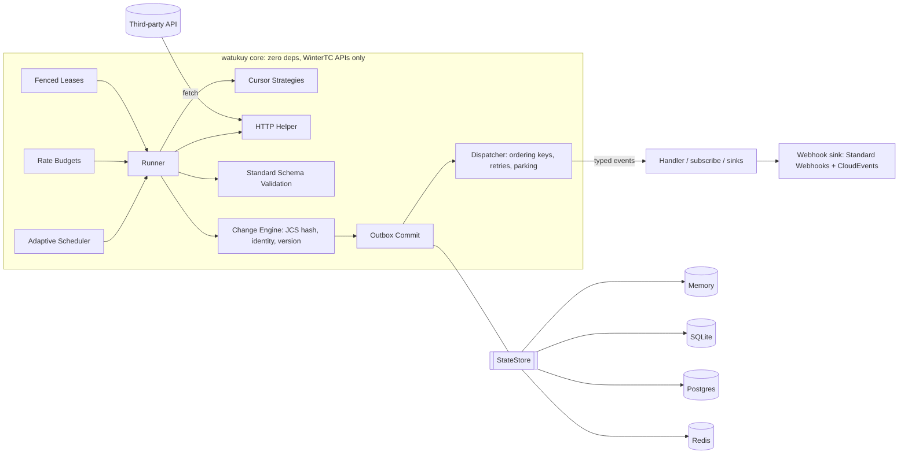

# watukuy

> **Webhooks para las APIs que no los tienen.**
> Captura de cambios (CDC) para APIs de terceros. Embebible, sin dependencias, se ejecuta en cualquier lugar.

[](https://www.npmjs.com/package/watukuy)
[](https://github.com/keynertyc/watukuy/actions/workflows/ci.yml)
[](https://github.com/keynertyc/watukuy/actions/workflows/ci.yml)
[](https://www.npmjs.com/package/watukuy#provenance)
[](https://github.com/keynertyc/watukuy/blob/main/.size-limit.json)
[](./LICENSE)

[English](./README.md)

## El problema

Bancos, ERPs, CRMs legacy, registros públicos, marketplaces, transportistas, sistemas de RR. HH. y el servicio del equipo de al lado no exponen **webhooks**. Entonces cada integración vuelve a construir la misma maquinaria frágil: un cursor que se salta filas cuando hay timestamps repetidos o cuando el proceso se cae, un diff que no detecta borrados, un loop de reintentos que convierte un `429` en un bloqueo, dos pods consultando el mismo endpoint dos veces, y un fan-out por tenant con N copias de todo lo anterior.

watukuy es un motor TypeScript embebible que convierte cualquier API de solo lectura (pull) en un stream tipado y correcto de eventos `created` / `updated` / `deleted`. Tú declaras cómo obtener los datos y cómo identificar cada ítem. El motor se encarga de cursores, paginación, scheduling, diffing, deduplicación, presupuestos de rate limit, reintentos, leases, durabilidad y observabilidad.

## Inicio rápido

```ts
import { createWatukuy, definePoller } from 'watukuy';
import { SqliteStore } from 'watukuy/store-sqlite';
import { z } from 'zod';

const Order = z.object({
  id: z.string(),
  updatedAt: z.iso.datetime(),
  status: z.enum(['open', 'paid', 'cancelled']),
  total: z.number(),
});

export const orders = definePoller({
  name: 'orders',
  schema: Order,                          // any Standard Schema v1 validator; infers the item type
  identity: (o) => o.id,                  // stable id per item
  version: (o) => o.updatedAt,            // optional; defaults to the content hash
  fingerprint: (o) => ({ status: o.status, total: o.total }), // optional; what counts as a change
  schemaVersion: 1,                       // bump deliberately when your fingerprint changes

  cursor: {
    strategy: 'timestamp',
    field: 'updatedAt',
    tieBreak: 'id',                       // composite keyset (updatedAt, id): no skipped ties
    initial: '2026-01-01T00:00:00Z',
    lag: '30s',                           // never read past now - lag (late commits)
    overlap: '2m',                        // re-scan this window each cycle; dedup by version
  },

  fetch: async ({ cursor, http, signal }) => {
    const res = await http.get('https://erp.example.com/orders', {
      query: { updated_since: cursor.value, after_id: cursor.tieBreak, limit: 500 },
      signal,
    });
    if (res.notModified) return { items: [] };   // ETag 304: nothing to diff, counts as idle
    const body = await res.json<{ data: unknown[]; has_more: boolean }>();
    return { items: body.data, hasMore: body.has_more };
  },

  schedule: { min: '5s', max: '5m', adaptive: true },
  budget: 'erp',                          // shared token bucket
});

const engine = createWatukuy({
  store: new SqliteStore({ path: './watukuy.db' }), // durable, zero dependencies
  budgets: { erp: { requests: 100, per: '1m' } },
  pollers: { orders },                    // keyed object: engine.on('orders') is fully typed
});

engine.on('orders', async (event) => {
  // event.type: 'created' | 'updated' | 'deleted'
  // event.data: Order        event.previous?: Order (when retain: 'payload')
  await queue.add('order-sync', event, { jobId: event.id }); // at-least-once + dedup by id
});

await engine.start();
```

Esa es toda la integración. Mata el proceso, escálalo a tres pods, recibe un `429`, trae una página con cincuenta `updatedAt` idénticos: el stream sigue siendo correcto.

## Qué obtienes

- **Cinco estrategias de cursor**: `timestamp` (keyset compuesto con `lag` y `overlap`), `token`, `page`, `snapshotDiff` (diff completo, detecta borrados) y `custom`.
- **Un motor de cambios de verdad**: hash canónico RFC 8785, atajo por `version`, selección con `fingerprint`, manejo de deriva de esquema con `schemaVersion`, `retain: 'payload'` para `previous`.
- **Outbox transaccional**: cursor, delta del snapshot y eventos se confirman en una sola transacción del store. Falla en cualquier punto; el outbox vuelve a entregar.
- **Entrega sobre la que puedes razonar**: claves de orden, concurrencia acotada, backoff exponencial con jitter completo, estacionamiento de eventos venenosos con `holdKey`, ack manual, `subscribe()` con backpressure.
- **Scheduling adaptativo y educado**: intervalo AIMD, pacing proactivo a partir de los headers `RateLimit`, esperas exactas por `Retry-After`, circuit breaker por poller.
- **Presupuestos de rate limit compartidos** entre pollers y tenants, con prioridad por lane (live > reconcile > backfill > replay) y fairness round-robin o ponderada.
- **Leases con fencing**: un solo poller activo por `(poller, partition)` entre instancias; un titular obsoleto no puede escribir.
- **Lanes**: `live`, `backfill`, `reconcile` (borrados en APIs incrementales), `replay` desde un log retenido.
- **Particiones** para fan-out multi-tenant: cursor, lease, schedule, circuito y outbox por tenant.
- **`tick()`** para serverless: una pasada acotada por invocación, con el estado compartido con el modo daemon.
- **Helper HTTP**: ETag/304, headers de rate limit IETF y de proveedores, `Retry-After`, Problem Details RFC 9457, cobro al presupuesto, redacción de headers. Nunca reintenta.
- **Observabilidad**: 16 hooks de ciclo de vida, spans y métricas con `watukuy/otel`, `inspect()` para endpoints de salud.
- **Testing determinista**: `VirtualClock`, `SeededRandom`, `FakeApi`. Sin sleeps, sin red.
- **Tipado de punta a punta**: el tipo del ítem se infiere de tu schema o de `identity`, los nombres de pollers son una unión literal, sin `any` en la superficie pública.

## Garantías

El README las promete y la suite de tests las demuestra. Detalles en [docs/guarantees.md](./docs/guarantees.md).

| # | Garantía |
|---|---|
| G1 | **Entrega al menos una vez.** Una vez observado un cambio en un ítem, su evento se entrega al handler al menos una vez. Nunca a lo sumo una vez. |
| G2 | **Ids de evento determinísticos.** La misma observación produce el mismo `event.id` entre reinicios, instancias y replays, así que los consumidores deduplican por id. |
| G3 | **Orden por clave.** Los eventos con la misma clave de orden (por defecto: la identidad del ítem) dentro de una partición de un poller se entregan en orden de observación. No hay orden entre claves. |
| G4 | **Commit atómico.** El nuevo cursor, el delta del snapshot y los eventos pendientes de un poll se confirman en una sola transacción del store (el outbox). No existe ventana en la que el cursor avanzó pero los eventos se perdieron. |
| G5 | **Un solo poller activo** por `(poller, partition)` en todas las instancias, mediante leases con epochs de fencing. Un titular de lease obsoleto no puede escribir. |
| G6 | **Los presupuestos de rate limit nunca se exceden** por parte de este proceso. Con un presupuesto respaldado en Redis, nunca se exceden entre instancias. |
| G7 | **Aislamiento de fallas.** Un handler que falla nunca bloquea otras claves de orden. Los eventos venenosos se estacionan con contexto completo y pueden reintentarse o descartarse. |
| G8 | **Determinista bajo test.** El reloj y la aleatoriedad son inyectables. La suite de tests tiene cero sleeps reales y cero red. |
| G9 | **Seguro ante caídas en cada punto de corte.** Matar el proceso en cualquier frontera del store se recupera vía el outbox. Demostrado por la suite de caos con semillas. |
| G10 | **Memoria acotada.** La concurrencia del handler y el backpressure del iterador acotan el trabajo en vuelo. Las páginas se procesan una por una, no se acumulan, salvo en `snapshotDiff`, que documenta su perfil de memoria. |

**No garantías explícitas:** exactamente una vez (deduplica por `event.id` en el consumidor); orden entre pollers o particiones; estados intermedios entre dos polls (A→B→A entre polls es invisible, compactación estándar de CDC); detección de borrados en estrategias incrementales sin un lane de reconcile.

## Se ejecuta en cualquier lugar

El modo daemon es `engine.start()`. El modo serverless es `engine.tick()`: una pasada sobre los pollers vencidos, páginas acotadas, outbox drenado, schedules persistidos, leases liberados, y retorna. Ambos modos comparten el mismo estado persistido, así que puedes mezclarlos.

```ts
// Cloudflare Workers cron trigger, AWS Lambda on EventBridge, Vercel cron, k8s CronJob
export default {
  scheduled: () => engine.tick({ maxDuration: '50s' }),
};
```

El núcleo usa solo la API común mínima de WinterTC (`fetch`, `AbortSignal`, Web Crypto, `TextEncoder`, timers, `queueMicrotask`). Sin imports `node:` fuera de los stores y adaptadores. CI corre la suite del núcleo en Node 22, 24, 26 y Bun. Ver [docs/serverless.md](./docs/serverless.md).

## Comparación

| | cron / `@nestjs/schedule` / BullMQ | Nango / Airbyte | Hookdeck / Svix | Inngest / Temporal / Trigger.dev | **watukuy** |
|---|---|---|---|---|---|
| Qué es | scheduler | plataforma de integración | infraestructura de webhooks | ejecución durable | motor de sync embebible |
| Cursores, diffing, dedup, borrados | lo construyes tú | sí | n/a | lo construyes tú | **sí** |
| Corre dentro del proceso de tu app | sí | no | no | parcialmente | **sí** |
| Los datos quedan en tu propio store | sí | DB de la plataforma | SaaS | mixto | **sí** |
| Cero dependencias en runtime | sí | no | no | no | **sí (núcleo)** |
| Modo serverless de una pasada | n/a | no | n/a | sí | **sí (`tick()`)** |
| Seguridad multi-instancia | lo construyes tú | sí | n/a | sí | **sí (leases con fencing)** |
| Tipado de punta a punta | parcialmente | no | no | sí | **sí** |

watukuy es complementario a colas y motores de ejecución durable: detecta cambios y emite eventos; BullMQ, Kafka, SQS, Inngest o Temporal los procesan. Trade-offs honestos en [docs/comparison.md](./docs/comparison.md).

## Arquitectura



Hexagonal: un núcleo de dominio puro, puertos para el store, el store de presupuestos, el reloj, la aleatoriedad, los hooks y el logger, y adaptadores en los bordes. Recorrido completo en [docs/how-it-works.md](./docs/how-it-works.md).

## Estrategias de cursor de un vistazo

| Estrategia | Para APIs con | Cursor que ve `fetch` | Borrados |
|---|---|---|---|
| `timestamp` | un filtro `updated_since` | `{ value, tieBreak }` keyset compuesto; parámetros `lag` y `overlap` | vía `reconcile` |
| `token` | un cursor opaco `next` | `{ value }`; devuelve `cursor: null` cuando estés al día | vía `reconcile` |
| `page` | números de página | `{ page }`; avanza mientras `hasMore`, se reinicia al terminar | vía `reconcile` |
| `snapshotDiff` | nada | `null`; listado completo en cada ciclo, comparado contra el snapshot | **incluido** |
| `custom` | cualquier otra cosa | tu propio tipo mediante `customCursor()` | vía `reconcile` |

Cuándo usar cuál, y las trampas del timestamp (empates, lag, overlap, formatos epoch): [docs/cursors.md](./docs/cursors.md).

## Semántica de entrega en 60 segundos

- Los eventos se confirman en un **outbox** junto con el cursor, y después se despachan. La entrega es al menos una vez.
- El dispatcher agrupa los eventos pendientes por **clave de orden** (por defecto `event.subject`, la identidad), corre hasta `delivery.concurrency` claves en paralelo, y es estrictamente secuencial dentro de una clave.
- Un handler que falla se **reintenta** con backoff exponencial y jitter completo (`attempts: 5`, base `1s`, factor 2, máximo `2m`). `event.attempt` indica el número de intento.
- Después del último intento el evento se **estaciona** como venenoso con el error y el historial de intentos. `holdKey: true` (por defecto) mantiene pendientes los eventos posteriores de esa clave para que el orden sobreviva; `engine.parked.retry()` los libera. `poison.action: 'halt'` abre el circuito del poller en su lugar.
- **Deduplica en el consumidor por `event.id`.** La reentrega tras una caída, los re-escaneos por overlap y los replays producen el mismo id para la misma observación.

Más en [docs/delivery.md](./docs/delivery.md).

## Multi-instancia y multi-tenant

Ejecuta tantas réplicas como quieras contra un solo store. Cada `(poller, partition)` está protegido por un lease con un epoch de fencing: exactamente una instancia lo consulta, y un titular que perdió su lease no puede escribir. Para conectores multi-tenant, `partitions()` devuelve una entrada por tenant; cada una tiene su propio cursor, lease, schedule, circuito, outbox y eventos estacionados, compartiendo la definición, el handler y el presupuesto. Las particiones removidas se pausan, no se borran. Ver [docs/multi-tenant.md](./docs/multi-tenant.md).

## Observabilidad

- **Hooks**: `onPollStart`, `onPollEnd`, `onFetch`, `onCommit`, `onEvent`, `onDelivered`, `onRetry`, `onParked`, `onInvalid`, `onError`, `onLeaseAcquired`, `onLeaseLost`, `onCircuitOpen`, `onCircuitClose`, `onBudgetWait`, `onScheduleChange`. Varios conjuntos de hooks se componen; un hook que lanza una excepción nunca afecta al motor.
- **`watukuy/otel`**: `otelHooks()` emite los spans `watukuy.poll` / `watukuy.fetch` / `watukuy.commit` / `watukuy.deliver` y un conjunto de métricas (`watukuy.poll.duration`, `watukuy.events.emitted`, `watukuy.circuit.state`, ...). No hace nada si no hay un SDK registrado.
- **`inspect()`**: por `(poller, partition)`: cursor, schedule, circuito, lease, último poll, pendientes en el outbox, cantidad de estacionados, cantidad de ítems, lag. Serializable para `/healthz`.

Ver [docs/observability.md](./docs/observability.md).

## Cómo probar tus pollers

```ts
import { createWatukuy, definePoller } from 'watukuy';
import { FakeApi, VirtualClock, SeededRandom, fakeItems } from 'watukuy/testing';
import { MemoryStore } from 'watukuy';

const clock = new VirtualClock('2026-01-01T00:00:00Z');
const api = new FakeApi({ clock, identity: (o) => o.id, timestampField: 'updatedAt', items: fakeItems(20) });

const items = definePoller({
  name: 'items',
  identity: (o: { id: string; updatedAt: string; value: number }) => o.id,
  version: (o) => o.updatedAt,
  cursor: { strategy: 'timestamp', field: 'updatedAt', tieBreak: 'id', initial: null },
  fetch: async ({ cursor }) => api.listSince({ since: cursor.value, afterId: cursor.tieBreak }),
  schedule: { min: '5s', max: '1m', jitter: 0 },
});

const engine = createWatukuy({ store: new MemoryStore(), pollers: { items }, clock, random: new SeededRandom(1) });
const seen: string[] = [];
engine.on('items', (e) => void seen.push(`${e.type}:${e.subject}`));

await engine.tick();                 // 20 created
api.update('item-001', { value: 99 });
await clock.advance(5_000);          // time only moves when you say so
await engine.tick();                 // 1 updated
```

`FakeApi` también sirve una función compatible con `fetch` (`api.fetchImpl()`) con fallas, `Retry-After`, ETags, headers de rate limit y latencia, así que el helper HTTP y el scheduler se pueden testear de punta a punta sin abrir un socket.

## Instalación y requisitos

```sh
npm install watukuy      # pnpm add watukuy / yarn add watukuy / bun add watukuy
```

- **Node >= 22.12**. CI corre Node 22, 24 y 26.
- **Solo ESM.** Los proyectos CommonJS (incluidas las apps NestJS compiladas a CJS) usan `require('watukuy')`, que funciona nativamente en Node 22.12+ vía `require(esm)`. No hay build dual.
- Peers opcionales solo para el subpath que importas: `pg` para `watukuy/store-postgres`; `redis` o `ioredis` para `watukuy/store-redis`; `@opentelemetry/api` para `watukuy/otel`; `@nestjs/common` y `@nestjs/core` (`>=11 <13`) para `watukuy/nestjs`. `watukuy/store-sqlite` usa `node:sqlite` y no necesita nada.
- Cero dependencias en runtime en el paquete publicado. Sin scripts de instalación. Publicado con provenance de npm.

## Documentación

| Doc | Qué cubre |
|---|---|
| [how-it-works.md](./docs/how-it-works.md) | Ciclo de poll, protocolo de commit, puntos de corte, máquina de estados del poller, lanes |
| [guarantees.md](./docs/guarantees.md) | G1..G10 en la práctica, cómo se testea cada una, no garantías |
| [cursors.md](./docs/cursors.md) | Las cinco estrategias, cuándo usar cuál, trampas del timestamp, `customCursor()` |
| [delivery.md](./docs/delivery.md) | Claves de orden, concurrencia, reintentos, parking vs halt, ack manual, `subscribe()`, dedup en el consumidor |
| [stores.md](./docs/stores.md) | Memory / SQLite / Postgres / Redis, migraciones, esquema, dimensionamiento, stores propios |
| [serverless.md](./docs/serverless.md) | `tick()` en Cloudflare Workers, Lambda, Vercel, k8s CronJob |
| [multi-tenant.md](./docs/multi-tenant.md) | Particiones, refresh, remoción, operaciones por partición |
| [nestjs.md](./docs/nestjs.md) | `WatukuyModule`, `@OnWatukuyEvent`, indicador de salud |
| [observability.md](./docs/observability.md) | Payloads de los hooks, OpenTelemetry, `inspect()`, endpoints de salud |
| [http-helper.md](./docs/http-helper.md) | `ctx.http`: validadores, headers de rate limit, Retry-After, Problem Details, redacción |
| [recipes.md](./docs/recipes.md) | BullMQ, SQS, Kafka, webhooks firmados, Inngest/Temporal, APIs sin ids, timestamps epoch, GraphQL |
| [runbook.md](./docs/runbook.md) | Operación: trigger, pausa, backfill, replay, reset, estacionados, leases bloqueados, circuitos, deriva |
| [comparison.md](./docs/comparison.md) | Comparación ampliada con trade-offs |
| [faq.md](./docs/faq.md) | Preguntas frecuentes |
| [stability.md](./docs/stability.md) | Política de semver, API pública, runtimes soportados, deprecaciones, seguridad |
| [api.md](./docs/api.md) | Referencia compacta de cada export |

Resumen legible por máquinas para agentes de código: [llms.txt](./llms.txt).

La documentación detallada está en inglés.

## Roadmap

Post-1.0, en el issue tracker: store sobre Durable Objects / KV para Cloudflare; hashing de snapshots por buckets (estilo Merkle) para datasets muy grandes; backfill paralelo particionado por ventana de tiempo; diagnósticos de deriva de esquema; ventanas activas y horas de silencio estilo cron; stores MySQL, MongoDB, DynamoDB; helpers de paginación GraphQL; compresión de payloads por ítem; UI de administración; recepción de webhooks con reconciliación contra polling; helper de store de idempotencia del lado del consumidor para exactamente-una-vez; adaptadores de store nativos para Deno; un servidor MCP que exponga `inspect()` y las operaciones a agentes.

## El nombre

*Watukuy* es quechua: visitar a alguien para ver cómo está. Un *chaski* era el corredor de relevos inca que llevaba las noticias por todo el imperio a lo largo del camino real, entregando el mensaje al siguiente corredor en cada posta. watukuy visita APIs de solo lectura según un calendario y vuelve con las noticias, y le entrega cada cambio a tu handler exactamente donde lo dejó.

## Licencia

[MIT](./LICENSE)
