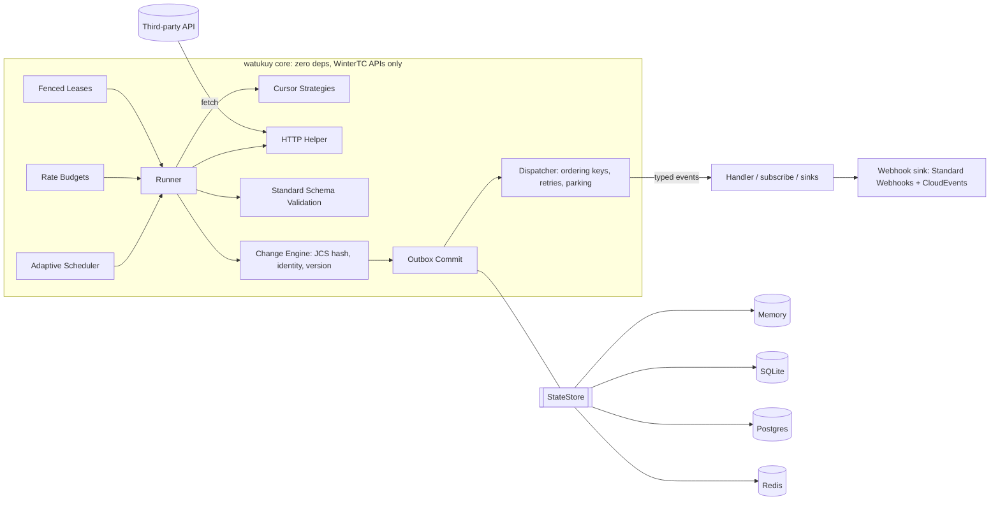

# watukuy

> **Webhooks for APIs that don't have them.**
> Change data capture for third-party APIs. Embeddable, zero dependencies, runs anywhere.

[](https://www.npmjs.com/package/watukuy)
[](https://github.com/keynertyc/watukuy/actions/workflows/ci.yml)
[](https://codecov.io/gh/keynertyc/watukuy)
[](https://www.npmjs.com/package/watukuy#provenance)
[](https://bundlephobia.com/package/watukuy)
[](./LICENSE)

[Español](./README.es.md)

## The problem

Banks, ERPs, legacy CRMs, government registries, marketplaces, carriers, HR systems, and the service the team next door all expose **no webhooks**. So every integration hand-rolls the same fragile machinery: a cursor that skips rows on timestamp ties or crashes, a diff that misses deletes, a retry loop that turns a `429` into a ban, two pods polling the same endpoint twice, and a tenant fan-out with N copies of all of the above.

watukuy is an embeddable TypeScript engine that turns any pull-only API into a correct, typed stream of `created` / `updated` / `deleted` events. You declare how to fetch and how to identify items. It owns cursors, pagination, scheduling, diffing, dedup, rate budgets, retries, leases, durability, and observability.

## Quickstart

```ts
import { createWatukuy, definePoller } from 'watukuy';
import { SqliteStore } from 'watukuy/store-sqlite';
import { z } from 'zod';

const Order = z.object({
  id: z.string(),
  updatedAt: z.iso.datetime(),
  status: z.enum(['open', 'paid', 'cancelled']),
  total: z.number(),
});

export const orders = definePoller({
  name: 'orders',
  schema: Order,                          // any Standard Schema v1 validator; infers the item type
  identity: (o) => o.id,                  // stable id per item
  version: (o) => o.updatedAt,            // optional; defaults to the content hash
  fingerprint: (o) => ({ status: o.status, total: o.total }), // optional; what counts as a change
  schemaVersion: 1,                       // bump deliberately when your fingerprint changes

  cursor: {
    strategy: 'timestamp',
    field: 'updatedAt',
    tieBreak: 'id',                       // composite keyset (updatedAt, id): no skipped ties
    initial: '2026-01-01T00:00:00Z',
    lag: '30s',                           // never read past now - lag (late commits)
    overlap: '2m',                        // re-scan this window each cycle; dedup by version
  },

  fetch: async ({ cursor, http, signal }) => {
    const res = await http.get('https://erp.example.com/orders', {
      query: { updated_since: cursor.value, after_id: cursor.tieBreak, limit: 500 },
      signal,
    });
    if (res.notModified) return { items: [] };   // ETag 304: nothing to diff, counts as idle
    const body = await res.json<{ data: unknown[]; has_more: boolean }>();
    return { items: body.data, hasMore: body.has_more };
  },

  schedule: { min: '5s', max: '5m', adaptive: true },
  budget: 'erp',                          // shared token bucket
});

const engine = createWatukuy({
  store: new SqliteStore({ path: './watukuy.db' }), // durable, zero dependencies
  budgets: { erp: { requests: 100, per: '1m' } },
  pollers: { orders },                    // keyed object: engine.on('orders') is fully typed
});

engine.on('orders', async (event) => {
  // event.type: 'created' | 'updated' | 'deleted'
  // event.data: Order        event.previous?: Order (when retain: 'payload')
  await queue.add('order-sync', event, { jobId: event.id }); // at-least-once + dedup by id
});

await engine.start();
```

That is the whole integration. Crash it, scale it to three pods, hit a `429`, get a page with fifty identical `updatedAt` values: the stream stays correct.

## What you get

- **Five cursor strategies**: `timestamp` (composite keyset with `lag` and `overlap`), `token`, `page`, `snapshotDiff` (full diff, detects deletes), and `custom`.
- **A real change engine**: RFC 8785 canonical hashing, `version` fast path, `fingerprint` selection, `schemaVersion` drift handling, `retain: 'payload'` for `previous`.
- **Transactional outbox**: cursor, snapshot delta, and events commit in one store transaction. Crash anywhere; the outbox replays.
- **Delivery you can reason about**: ordering keys, bounded concurrency, exponential backoff with full jitter, poison parking with `holdKey`, manual ack, `subscribe()` with backpressure.
- **Adaptive, polite scheduling**: AIMD interval, proactive pacing from `RateLimit` headers, exact `Retry-After` sleeps, per-poller circuit breaker.
- **Shared rate budgets** across pollers and tenants, with lane priority (live > reconcile > backfill > replay) and round-robin or weighted fairness.
- **Fenced leases**: one active poller per `(poller, partition)` across instances; stale holders cannot write.
- **Lanes**: `live`, `backfill`, `reconcile` (deletes for incremental APIs), `replay` from a retained log.
- **Partitions** for multi-tenant fan-out: per-tenant cursor, lease, schedule, circuit, outbox.
- **`tick()`** for serverless: one bounded pass per invocation, state shared with daemon mode.
- **HTTP helper**: ETag/304, IETF and vendor rate-limit headers, `Retry-After`, RFC 9457 Problem Details, budget charging, header redaction. Never retries.
- **Observability**: 16 lifecycle hooks, `watukuy/otel` spans and metrics, `inspect()` for health endpoints.
- **Deterministic testing**: `VirtualClock`, `SeededRandom`, `FakeApi`. No sleeps, no network.
- **Typed end to end**: item type inferred from your schema or `identity`, poller names are a literal union, no `any` in the public surface.

## Guarantees

The README promises these and the test suite proves them. Details in [docs/guarantees.md](./docs/guarantees.md).

| # | Guarantee |
|---|---|
| G1 | **At-least-once delivery.** Once an item change is observed, its event is delivered to the handler at least once. Never at-most-once. |
| G2 | **Deterministic event ids.** The same observation produces the same `event.id` across restarts, instances, and replays, so consumers dedup by id. |
| G3 | **Ordering per key.** Events with the same ordering key (default: item identity) within one poller partition are delivered in observation order. No ordering across keys. |
| G4 | **Atomic commit.** The new cursor, the snapshot delta, and the pending events of a poll are committed in a single store transaction (the outbox). There is no window where the cursor advanced but events were lost. |
| G5 | **Single active poller** per `(poller, partition)` across all instances, via leases with fencing epochs. A stale lease holder cannot write. |
| G6 | **Rate budgets are never exceeded** by this process. With a Redis-backed budget, never exceeded across instances. |
| G7 | **Isolation of failures.** A failing handler never blocks other ordering keys. Poison events park with full context and can be retried or discarded. |
| G8 | **Deterministic under test.** Clock and randomness are injectable. The test suite has zero real sleeps and zero network. |
| G9 | **Crash-safe at every kill point.** Killing the process at any store boundary recovers via the outbox. Proven by the seeded chaos suite. |
| G10 | **Bounded memory.** Handler concurrency and iterator backpressure bound in-flight work. Pages are staged, not accumulated, except in `snapshotDiff`, which documents its memory profile. |

**Explicit non-guarantees:** exactly-once (dedup by `event.id` at the consumer); ordering across pollers or partitions; intermediate states between two polls (A→B→A between polls is invisible, which is standard CDC compaction); detecting deletes on incremental strategies without a reconcile lane.

## Runs anywhere

Daemon mode is `engine.start()`. Serverless mode is `engine.tick()`: one pass over due pollers, bounded pages, outbox drained, schedules persisted, leases released, then return. Both modes share the same persisted state, so you can mix them.

```ts
// Cloudflare Workers cron trigger, AWS Lambda on EventBridge, Vercel cron, k8s CronJob
export default {
  scheduled: () => engine.tick({ maxDuration: '50s' }),
};
```

The core uses only the WinterTC minimum common API (`fetch`, `AbortSignal`, Web Crypto, `TextEncoder`, timers, `queueMicrotask`). No `node:` imports outside stores and adapters. CI runs the core suite on Node 22, 24, 26 and Bun. See [docs/serverless.md](./docs/serverless.md).

## How it compares

| | cron / `@nestjs/schedule` / BullMQ | Nango / Airbyte | Hookdeck / Svix | Inngest / Temporal / Trigger.dev | **watukuy** |
|---|---|---|---|---|---|
| What it is | scheduler | integration platform | webhook infra | durable execution | embeddable sync engine |
| Cursors, diffing, dedup, deletes | you build it | yes | n/a | you build it | **yes** |
| Runs inside your app process | yes | no | no | partially | **yes** |
| Data stays in your own store | yes | platform DB | SaaS | mixed | **yes** |
| Zero runtime dependencies | yes | no | no | no | **yes (core)** |
| Serverless one-shot mode | n/a | no | n/a | yes | **yes (`tick()`)** |
| Multi-instance safety | you build it | yes | n/a | yes | **yes (fenced leases)** |
| Typed end-to-end | partially | no | no | yes | **yes** |

watukuy is complementary to queues and durable execution: it detects changes and emits events; BullMQ, Kafka, SQS, Inngest, or Temporal process them. Honest trade-offs in [docs/comparison.md](./docs/comparison.md).

## Architecture



Hexagonal: a pure domain core, ports for the store, budget store, clock, random, hooks, and logger, adapters at the edges. Full walkthrough in [docs/how-it-works.md](./docs/how-it-works.md).

## Cursor strategies at a glance

| Strategy | For APIs with | Cursor seen by `fetch` | Deletes |
|---|---|---|---|
| `timestamp` | an `updated_since` filter | `{ value, tieBreak }` composite keyset; `lag` and `overlap` knobs | via `reconcile` |
| `token` | an opaque `next` cursor | `{ value }`; return `cursor: null` when caught up | via `reconcile` |
| `page` | page numbers | `{ page }`; advances while `hasMore`, resets when done | via `reconcile` |
| `snapshotDiff` | nothing | `null`; full listing every cycle, diffed against the snapshot | **built in** |
| `custom` | anything else | your own type via `customCursor()` | via `reconcile` |

When to use which, and the timestamp pitfalls (ties, lag, overlap, epoch formats): [docs/cursors.md](./docs/cursors.md).

## Delivery semantics in 60 seconds

- Events are committed to an **outbox** with the cursor, then dispatched. Delivery is at-least-once.
- The dispatcher groups pending events by **ordering key** (default `event.subject`, the identity), runs up to `delivery.concurrency` keys in parallel, and is strictly sequential within a key.
- A failing handler is **retried** with exponential backoff and full jitter (`attempts: 5`, base `1s`, factor 2, max `2m`). `event.attempt` tells you which try this is.
- After the last attempt the event is **parked** as poison with the error and attempt history. `holdKey: true` (default) keeps later events for that key pending so order survives; `engine.parked.retry()` releases them. `poison.action: 'halt'` opens the poller's circuit instead.
- **Dedup at the consumer by `event.id`.** Crash re-delivery, overlap re-scans, and replays all produce the same id for the same observation.

More in [docs/delivery.md](./docs/delivery.md).

## Multi-instance and multi-tenant

Run as many replicas as you like against one store. Each `(poller, partition)` is protected by a lease with a fencing epoch: exactly one instance polls it, and a holder that lost its lease cannot write. For multi-tenant connectors, `partitions()` returns one entry per tenant; each gets its own cursor, lease, schedule, circuit, outbox, and parked events while sharing the definition, handler, and budget. Removed partitions are paused, not deleted. See [docs/multi-tenant.md](./docs/multi-tenant.md).

## Observability

- **Hooks**: `onPollStart`, `onPollEnd`, `onFetch`, `onCommit`, `onEvent`, `onDelivered`, `onRetry`, `onParked`, `onInvalid`, `onError`, `onLeaseAcquired`, `onLeaseLost`, `onCircuitOpen`, `onCircuitClose`, `onBudgetWait`, `onScheduleChange`. Multiple hook sets compose; a throwing hook never affects the engine.
- **`watukuy/otel`**: `otelHooks()` emits `watukuy.poll` / `watukuy.fetch` / `watukuy.commit` / `watukuy.deliver` spans and a metrics set (`watukuy.poll.duration`, `watukuy.events.emitted`, `watukuy.circuit.state`, ...). No-op without a registered SDK.
- **`inspect()`**: per `(poller, partition)` cursor, schedule, circuit, lease, last poll, outbox pending, parked count, item count, lag. Serializable for `/healthz`.

See [docs/observability.md](./docs/observability.md).

## Testing your pollers

```ts
import { createWatukuy, definePoller } from 'watukuy';
import { FakeApi, VirtualClock, SeededRandom, fakeItems } from 'watukuy/testing';
import { MemoryStore } from 'watukuy';

const clock = new VirtualClock('2026-01-01T00:00:00Z');
const api = new FakeApi({ clock, identity: (o) => o.id, timestampField: 'updatedAt', items: fakeItems(20) });

const items = definePoller({
  name: 'items',
  identity: (o: { id: string; updatedAt: string; value: number }) => o.id,
  version: (o) => o.updatedAt,
  cursor: { strategy: 'timestamp', field: 'updatedAt', tieBreak: 'id', initial: null },
  fetch: async ({ cursor }) => api.listSince({ since: cursor.value, afterId: cursor.tieBreak }),
  schedule: { min: '5s', max: '1m', jitter: 0 },
});

const engine = createWatukuy({ store: new MemoryStore(), pollers: { items }, clock, random: new SeededRandom(1) });
const seen: string[] = [];
engine.on('items', (e) => void seen.push(`${e.type}:${e.subject}`));

await engine.tick();                 // 20 created
api.update('item-001', { value: 99 });
await clock.advance(5_000);          // time only moves when you say so
await engine.tick();                 // 1 updated
```

`FakeApi` also serves a `fetch`-compatible function (`api.fetchImpl()`) with faults, `Retry-After`, ETags, rate-limit headers, and latency, so the HTTP helper and scheduler are testable end to end without a socket.

## Install and requirements

```sh
npm install watukuy      # pnpm add watukuy / yarn add watukuy / bun add watukuy
```

- **Node >= 22.12**. CI runs Node 22, 24, and 26.
- **ESM-only.** CommonJS projects (including NestJS apps compiled to CJS) use `require('watukuy')`, which works natively on Node 22.12+ via `require(esm)`. There is no dual build.
- Optional peers only for the subpath you import: `pg` for `watukuy/store-postgres`; `redis` or `ioredis` for `watukuy/store-redis`; `@opentelemetry/api` for `watukuy/otel`; `@nestjs/common` and `@nestjs/core` (`>=11 <13`) for `watukuy/nestjs`. `watukuy/store-sqlite` uses `node:sqlite` and needs nothing.
- Zero runtime dependencies in the published package. No install scripts. Published with npm provenance.

## Documentation

| Doc | What it covers |
|---|---|
| [how-it-works.md](./docs/how-it-works.md) | Poll cycle, commit protocol, kill points, poller state machine, lanes |
| [guarantees.md](./docs/guarantees.md) | G1..G10 in practice, how each is tested, non-guarantees |
| [cursors.md](./docs/cursors.md) | The five strategies, when to use which, timestamp pitfalls, `customCursor()` |
| [delivery.md](./docs/delivery.md) | Ordering keys, concurrency, retries, parking vs halt, manual ack, `subscribe()`, consumer dedup |
| [stores.md](./docs/stores.md) | Memory / SQLite / Postgres / Redis, migrations, schema, sizing, custom stores |
| [serverless.md](./docs/serverless.md) | `tick()` on Cloudflare Workers, Lambda, Vercel, k8s CronJob |
| [multi-tenant.md](./docs/multi-tenant.md) | Partitions, refresh, removal, per-partition operations |
| [nestjs.md](./docs/nestjs.md) | `WatukuyModule`, `@OnWatukuyEvent`, health indicator |
| [observability.md](./docs/observability.md) | Hooks payloads, OpenTelemetry, `inspect()`, health endpoints |
| [http-helper.md](./docs/http-helper.md) | `ctx.http`: validators, rate-limit headers, Retry-After, Problem Details, redaction |
| [recipes.md](./docs/recipes.md) | BullMQ, SQS, Kafka, signed webhooks, Inngest/Temporal, ids-less APIs, epoch timestamps, GraphQL |
| [runbook.md](./docs/runbook.md) | Operations: trigger, pause, backfill, replay, reset, parked, stuck leases, circuits, drift |
| [comparison.md](./docs/comparison.md) | Expanded comparison with trade-offs |
| [faq.md](./docs/faq.md) | Frequently asked questions |
| [stability.md](./docs/stability.md) | Semver policy, public API, supported runtimes, deprecations, security |
| [api.md](./docs/api.md) | Compact reference of every export |

Machine-readable summary for coding agents: [llms.txt](./llms.txt).

## Roadmap

Post-1.0, tracked in the issue tracker: Durable Object / KV store for Cloudflare; bucketed (Merkle-style) snapshot hashing for very large datasets; parallel backfill sharding by time window; schema-drift diagnostics; cron-style active windows and quiet hours; MySQL, MongoDB, DynamoDB stores; GraphQL pagination helpers; per-item payload compression; admin UI; webhook receiving with reconciliation against polling; a consumer-side idempotency store helper for exactly-once; Deno-native store adapters; an MCP server exposing `inspect()` and operations to agents.

## The name

*Watukuy* is Quechua for visiting someone to check on them. A *chaski* was the Inca relay runner who carried news across the empire along the road network, handing the message to the next runner at each station. watukuy visits pull-only APIs on a schedule and comes back with the news, then hands each change to your handler exactly where it left off.

## License

[MIT](./LICENSE)
