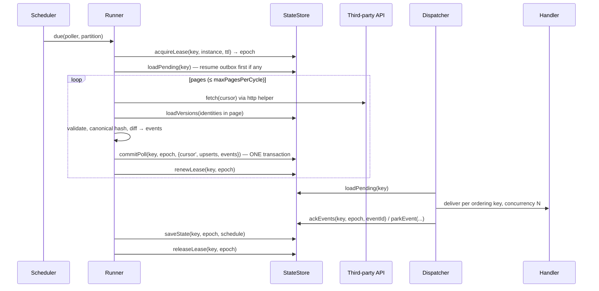
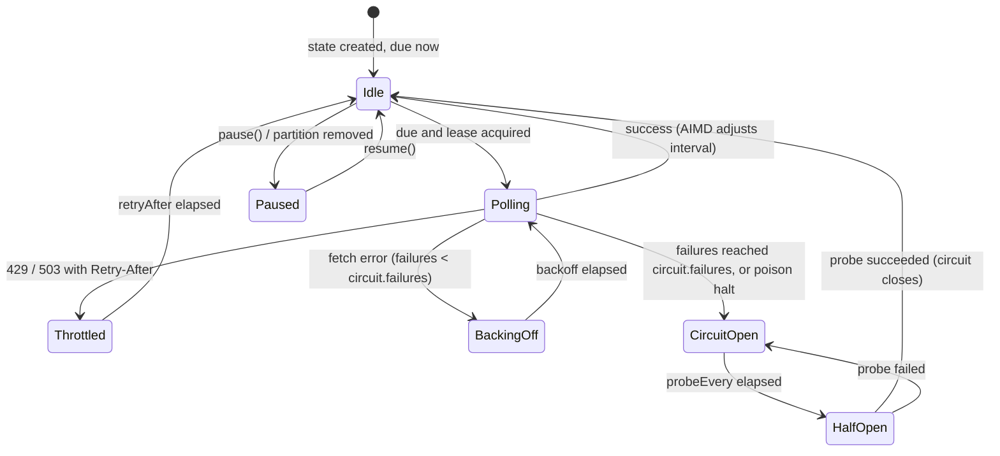

# How it works

watukuy is a loop that visits an API, decides what changed, and hands you the changes. Every step of that loop is designed so a crash, a slow handler, a `429`, or a second instance cannot produce a skipped, lost, or reordered event. This document walks the poll cycle, the commit protocol that makes it crash-safe, the kill points the chaos suite exercises, the poller state machine, and the four lanes.

## The poll cycle

One run for a `(poller, partition)` key, in order:

1. **Is there anything to do?** The runner loads the persisted state and returns early when the key is paused, or when the live lane is not due, no reconcile is due, no backfill is active, and the outbox is empty. `tick()` reports these as `skippedNotDue`.
2. **Acquire the lease.** `acquireLease(key, instanceId, ttl)` returns a `Lease { owner, epoch, expiresAt }` or `null` if another instance holds it (`skippedLeased`). The epoch increments on every acquisition and is passed to every write for the rest of the run. A `LeaseKeeper` renews it on a heartbeat (`ttl / 3` by default) and after every committed page.
3. **Drain the outbox first.** Anything a previous process committed but never delivered is dispatched before a single request is made. This is what makes G1 and G9 true.
4. **Live lane** (when due, or forced by `trigger()`): fetch a page, validate items against the schema, compute identity, version, and fingerprint hash, load the stored rows for those identities, diff, and `commitPoll` the new cursor, the upserted rows, and the pending events in one transaction. Then dispatch the events that were just committed, renew the lease, and repeat while the strategy says there is more (`hasMore: true`) up to `maxPagesPerCycle` or the `tick()` deadline.
5. **Reconcile lane** (when `reconcile.every` has elapsed): a full listing with the `page` strategy, using the same diff, followed by `deleted` events for every stored identity that was not listed.
6. **Backfill lane** (while a backfill is active): the same live logic from an older cursor, tagged `lane: 'backfill'`, stopping at the target cursor.
7. **Persist the schedule** (next due time, interval, circuit, last poll summary, last error) and **release the lease**.

Cycles of different keys run concurrently. Within one key, lanes run sequentially in the order above.

## The commit protocol

The whole design rests on `commitPoll(key, lease, batch)` being one transaction. The batch carries:

| Field | Contents |
|---|---|
| `statePatch` | The next lane cursor, the last outbox `sequence`, the poller's `schemaVersion`, `updatedAt` |
| `upserts` | `ItemRow[]`: identity, version, hash, schemaVersion, optional payload, seenAt |
| `deletes` | identities to remove from the snapshot (full-scan lanes only) |
| `events` | `OutboxRow[]` with `status: 'pending'` |
| `log` | whether to also append the events to the replay log |
| `parked` | quarantined invalid items, written in the same transaction |

Rules:

1. **Drain before fetch.** A cycle delivers the pending outbox before fetching. Events are never lost between "committed" and "delivered", they are just late.
2. **Commit per page** for `timestamp`, `token`, `page`, and `custom`. A crash after page 3 of 10 resumes from the page-3 cursor with page-3 events already in the outbox. For `snapshotDiff` and `reconcile`, pages also commit as they arrive (upserts plus `created` / `updated` events), and a final commit after the last page writes the `deleted` events. Deletes require the whole listing to have completed in this cycle: a truncated scan (by `maxPagesPerCycle` or a `tick()` deadline) or a `304 Not Modified` response never produces deletes.
3. **Every write is fenced.** The store compares the lease epoch on every mutating call and throws `LeaseLostError` on a mismatch. The runner then abandons the cycle and discards its in-memory work. Nothing half-written reaches the store.
4. **Catch-up mode.** `hasMore: true` makes the runner fetch again immediately with the derived cursor. After `maxPagesPerCycle` (default 50) the cycle stops with `truncated: true` and the scheduler marks the key due again immediately (reason `catch-up`), still honoring rate-limit pacing.
5. **The cursor and the events are the same write.** There is no ordering between "advance cursor" and "enqueue events" to get wrong, because there is only one write.

## Kill points

The chaos suite (`runChaos` in `watukuy/testing`) kills and restarts the runner at each of these boundaries and checks the guarantees afterwards. The harness names are the `KillPoint` values.

| Kill point | Harness name | Where | What recovery looks like |
|---|---|---|---|
| K1 | `before-acquire` | Before the lease is acquired | Nothing happened. Next run acquires and proceeds. |
| K2 | `after-fetch` | After `fetch`, before `commitPoll` persists | The page is re-fetched on the next run. No cursor moved, no event exists. |
| K3 | `after-commit` | After `commitPoll`, before dispatch | The events sit in the outbox with the advanced cursor. The next run drains them first. Ids are identical. |
| K4 | `mid-dispatch`, `before-ack` | Mid-dispatch: some events acked, or the handler ran and the ack failed | Unacked events are redelivered. Acked ones are not. Per-key order holds because acks are per event in sequence order. |
| K5, K6 | `after-ack-before-schedule` | After the last ack, before the schedule is saved | The schedule keeps its previous value, so the key is due again sooner than planned. Harmless. |
| K7 | `during-release` | During the lease release | The lease lingers until `ttl` expires (default 30s). Until then, other instances see `skippedLeased`. |
| handler | `handler` | The consumer throws once | Not a process crash: the dispatcher retries with backoff. |

The harness's `FaultyStore` wraps a real store to raise these failures at the exact call, and drops the engine without `stop()` when one fires. Because stores are transactional, a failed commit persists nothing.

## Poller state machine

Each `(poller, partition)` carries a persisted `ScheduleState`. The transitions below are computed by pure functions and stored, so daemon mode, `tick()`, and every instance agree.

- **AIMD.** The interval starts at `schedule.min`. A cycle that emitted events halves it (floored at `min`); an idle cycle, including `304 Not Modified`, multiplies it by 1.5 (capped at `max`). Symmetric jitter of `schedule.jitter` (default 10%) is applied to every wait. `adaptive: false` pins the interval at `min`.
- **Pacing.** When the last response carried `RateLimit` headers with `remaining` and a reset time, the wait is stretched to `(resetAt - now) / max(remaining, 1)` so the remaining requests last until the window resets. This happens before any `429`.
- **Throttle.** A `429`, or a `503` with `Retry-After`, sleeps exactly as instructed (the header may be seconds or an HTTP-date), does not count as a failure, and leaves the circuit alone.
- **Backoff.** Other errors back off exponentially with full jitter (`schedule.backoff`: base `1s`, factor 2, max `10m`).
- **Circuit.** After `circuit.failures` consecutive failures (default 5) the circuit opens and the key sleeps for `circuit.probeEvery` (default `schedule.max`). The next run is a half-open probe; success closes the circuit and resets the failure count, failure keeps it open. `trigger()` on an open circuit forces a probe.
- **Poison halt.** With `delivery.poison.action: 'halt'`, a poison event opens the circuit directly and records `lastError.name === 'PoisonHalt'`.

## Lanes

| Lane | Started by | Cursor | Priority in shared budgets | Ends when |
|---|---|---|---|---|
| `live` | the scheduler | the poller's strategy | highest | the strategy reports `done` or the page cap is hit |
| `reconcile` | `reconcile.every` elapsing | `page` from 1, over `reconcile.fetch` | second | the full listing completes; then `deleted` events are emitted for missing identities |
| `backfill` | `engine.backfill(name, { from, to?, force? })` | the poller's strategy from `from` | third | the cursor reaches `to` (default: the live cursor at the time of the call) |
| `replay` | `engine.replay(name, { from, to? })` | none: rows are copied from the log into the outbox | lowest | immediately; the copied events are delivered on the next drain |

Events carry `lane` so consumers can tell them apart. Backfill events for an identity whose version is already known are suppressed unless `force: true`, in which case every known item is re-emitted as `updated`. Replay re-emits the logged events with their original `id` and a fresh `sequence`.

## Where things live

| Concern | Module |
|---|---|
| Public API, engine, runner, dispatcher, leases, envelope | `src/core` |
| AIMD, pacing, throttle, backoff, circuit | `src/scheduler` |
| Five cursor strategies | `src/cursor` |
| RFC 8785 canonicalization, hashing, ids, diff | `src/diff` |
| Token buckets, fairness, lane priority | `src/budget` |
| `ctx.http` | `src/http` |
| Standard Schema validation | `src/validate` |
| Stores | `src/stores/{memory,sqlite,postgres,redis}` |
| Adapters | `src/nestjs`, `src/otel`, `src/sinks`, `src/testing`, `src/cli` |

The core directories contain no `node:` imports. A test enforces it.

Related: [guarantees.md](./guarantees.md), [cursors.md](./cursors.md), [delivery.md](./delivery.md), [stores.md](./stores.md).
